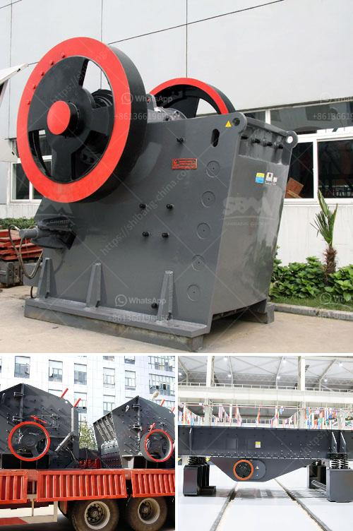

<h3>maintenance plan of crusher</h3>
A crusher is a machine used to reduce the size of large rocks into smaller rocks, gravel, sand, or rock dust. Crushers are commonly used for crushing ore into finer particles to improve the efficiency of subsequent grinding processes. In the crushing industry, routine maintenance is critical to ensure the smooth operation of equipment and to prevent costly breakdowns.

A well-planned maintenance schedule for crushers is essential in maximizing the life span of the equipment. Proper maintenance helps to reduce unscheduled downtime and keep the crusher running at peak performance, resulting in lower overall operating costs.

1. Regular lubrication: Crushers rely on proper lubrication to function effectively. Lubricating all moving parts regularly ensures smooth operation and prevents excessive wear. It is important to follow the manufacturer's recommendations for the type and frequency of lubrication.

2. Inspection and maintenance of wear parts: Crushers contain several components that experience high wear, such as the liners, blow bars, and jaws. These wear parts should be inspected regularly for signs of wear and replaced as needed. Failure to replace worn parts can result in reduced crushing efficiency and even damage to the crusher itself.

3. Cleaning and clearing blockages: Crushers can become clogged with material, affecting their performance. Regular cleaning of the crusher and its components is essential to remove any build-up of material. Additionally, blockages should be cleared promptly to prevent damage to the crusher and avoid costly downtime.

4. Regular calibration and adjustment: Crushers need to be calibrated and adjusted to ensure consistent and accurate performance. This includes checking the settings of the crusher's gap, eccentric throw, and chamber profile. Proper calibration helps to achieve the desired product size and shape while minimizing the risk of uneven wear.

5. Monitoring and managing operating conditions: Crusher performance can be greatly affected by factors such as feed size, material type, and moisture content. Monitoring these operating conditions allows for adjustments to be made to optimize performance and prevent unnecessary strain on the crusher.

6. Training and education: Properly trained personnel play a crucial role in maintaining crushers. It is important to provide training to operators and maintenance staff on the safe and efficient use of crushers. They should be familiar with the maintenance procedures, troubleshooting techniques, and safety protocols to minimize the risk of accidents and equipment damage.

In conclusion, a well-executed maintenance plan is vital for the efficient operation of crushers. By following a comprehensive maintenance schedule, including regular lubrication, inspection and maintenance of wear parts, cleaning and clearing blockages, calibration and adjustment, monitoring and managing operating conditions, and providing training and education, operators can ensure that crushers run smoothly and consistently. Proper maintenance ultimately leads to extended equipment life, reduced downtime, and increased productivity, resulting in cost savings for the overall operation.
<h3>Contact us</h3><ul><li><strong>Whatsapp:&nbsp;<a href="https://wa.me/8613661969651">+8613661969651</a></strong></li><li><a href="https://swt.shibang-china.com/?git&amp;zhl&amp;maintenance plan of crusher"><strong>Online Service(chat now)</strong></a></li></ul><h3>Related</h3><ul><li><a href='price of roller mill machine.md'>price of roller mill machine</a></li><li><a href='fine powder mill.md'>fine powder mill</a></li><li><a href='best grinding mills of chslk limestone.md'>best grinding mills of chslk limestone</a></li><li><a href='aggregate crusher production equipment.md'>aggregate crusher production equipment</a></li><li><a href='magnesite processing equipment price.md'>magnesite processing equipment price</a></li></ul>