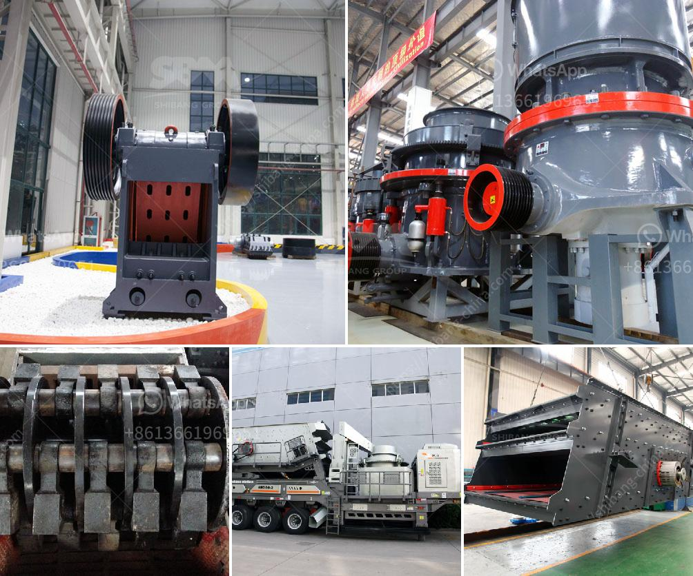

<h3>making gypsum powder mill</h3>
Gypsum is a versatile mineral that has been used for centuries in a variety of applications. One of the most common uses for gypsum is in the construction industry, where it is used to make plaster and drywall. However, gypsum can also be ground into a fine powder and used to create materials such as cement and fertilizer.

If you are interested in making gypsum powder, a gypsum powder mill is a necessary piece of equipment. This mill grinds the gypsum into a fine powder, which can be used for a variety of purposes. Here are some steps to help you get started with your gypsum powder mill.

1. Acquire the necessary equipment: To make gypsum powder, you will need a gypsum powder mill. There are several options available on the market, so do some research to find the best one for your needs. Look for a mill that is easy to operate, has a high grinding efficiency, and produces a consistent powder size.

2. Prepare the gypsum: Before you can grind the gypsum into a fine powder, it needs to be crushed into small pieces. This can be done using a jaw crusher or a hammer crusher, depending on the size of the gypsum pieces. Once crushed, the gypsum can be stored in a bin or a hopper until it is ready to be fed into the mill.

3. Set up the mill: Install the gypsum powder mill in a suitable location in your facility. Ensure that it is securely anchored to the ground and that there is enough space around it for easy operation and maintenance. Connect the mill to the power supply and make sure all safety measures are in place.

4. Feed the gypsum into the mill: Use a conveyor belt or a bucket elevator to transfer the gypsum from the storage bin to the mill. The gypsum will then be fed into the grinding chamber, where it will be ground into a fine powder by the rotating blades or hammers of the mill. The speed and direction of the blades can be adjusted to achieve the desired powder size.

5. Collect the powder: As the gypsum is ground, it will be carried by the airflow through a classifier, where the finer particles are separated from the coarser ones. The finer powder will be collected in a cyclone separator or a bag filter, while the coarser particles will be returned to the mill for further grinding. The collected powder can then be stored in bags or containers for later use.

By following these steps, you can easily make gypsum powder using a gypsum powder mill. This versatile material can be used in a wide range of applications, from construction to agriculture. Whether you are a homeowner or a business owner, having a gypsum powder mill can be a valuable investment. It allows you to produce your own gypsum powder, saving you time and money in the long run.
<h3>Contact us</h3><ul><li><strong>Whatsapp:&nbsp;<a href="https://wa.me/8613661969651">+8613661969651</a></strong></li><li><a href="https://swt.shibang-china.com/?git&amp;zhl&amp;making gypsum powder mill"><strong>Online Service(chat now)</strong></a></li></ul><h3>Related</h3><ul><li><a href='bauxite mines crusher in dubai.md'>bauxite mines crusher in dubai</a></li><li><a href='supplier of grinding stone.md'>supplier of grinding stone</a></li><li><a href='how vertical roller mill works.md'>how vertical roller mill works</a></li><li><a href='jaw crusher price saudi.md'>jaw crusher price saudi</a></li><li><a href='limestone ball mill in egypt.md'>limestone ball mill in egypt</a></li></ul>