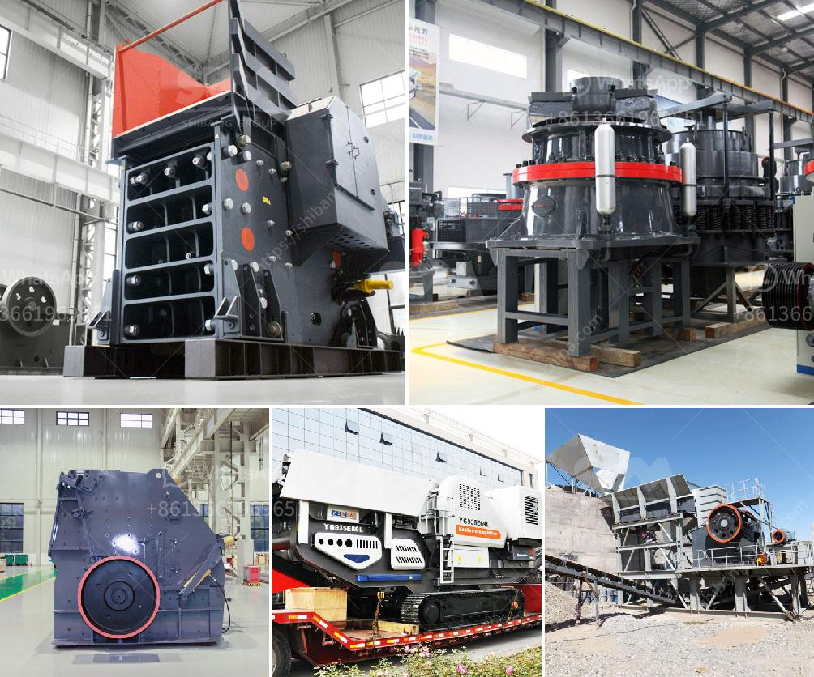

<h3>malaysia ball mill</h3>
A ball mill, a critical equipment for grinding various materials, comprises a cylindrical shell filled with grinding media, such as balls, usually made of steel. As the shell rotates, the grinding balls are lifted and then cascaded, resulting in an impact that extracts the desired particle size.

In Malaysia, ball mills are widely utilized in various industries, including cement, mining, metallurgy, ceramics, and energy. With the continuous advancement of technology, these mills have been greatly improved and integrated to enhance performances and productivity.

The primary purpose of a ball mill is to reduce the size of materials into smaller particles. This process is achieved by grinding the material in a rotating cylinder and allowing it to be impacted and crushed by the grinding media. The particle fineness can be controlled by varying the speed of the mill and the size of the grinding media.

The benefits of using ball mills in Malaysia are numerous. Firstly, these mills are cost-effective, as they require minimal maintenance and power consumption. Additionally, they can grind a wide range of materials, including brittle and fibrous ones, with high precision and efficiency.

Moreover, ball mills have a versatile application, thereby making them suitable for both dry and wet grinding processes. This versatility allows manufacturers to produce a diverse range of products, such as paints, ceramics, pigments, and pharmaceuticals.

In conclusion, ball mills are indispensable equipment in various industries in Malaysia. Their ability to reduce the size of materials and grind them with precision and efficiency makes them a vital tool for industrial processes. The continuous advancement of technology ensures that these mills will continue to improve, enabling Malaysia to keep up with global industrial demands.
<h3>Contact us</h3><ul><li><strong>Whatsapp:&nbsp;<a href="https://wa.me/8613661969651">+8613661969651</a></strong></li><li><a href="https://swt.shibang-china.com/?git&amp;zhl&amp;malaysia ball mill"><strong>Online Service(chat now)</strong></a></li></ul><h3>Related</h3><ul><li><a href='mobile stone crusher machine europa.md'>mobile stone crusher machine europa</a></li><li><a href='cement clinker grinding mill.md'>cement clinker grinding mill</a></li><li><a href='mtm 160 ball mill spare parts suppliers in india.md'>mtm 160 ball mill spare parts suppliers in india</a></li><li><a href='hammer crusher taiwan.md'>hammer crusher taiwan</a></li><li><a href='quarry stone crusher for sale in south africa.md'>quarry stone crusher for sale in south africa</a></li></ul>