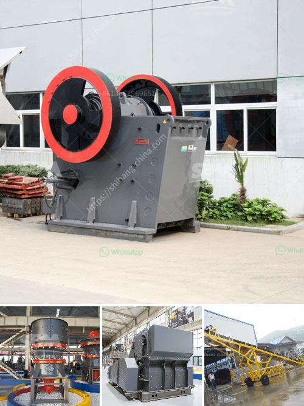

<h3>malaysia heavy industries crushing equipment china</h3>
Malaysia Heavy Industries have established themselves as significant players in the global market by providing superior crushing equipment. However, in recent years, China has emerged as a formidable competitor, leveraging its manufacturing prowess and technological advancements. The Malaysian heavy industries face a tough challenge in maintaining their market share, and this article explores the various factors that have led to China's rise and the countermeasures that Malaysia can adopt to sustain their position.

China is well-known for its manufacturing capabilities, and this extends to the heavy equipment industry as well. They have invested heavily in research and development, leading to the production of cutting-edge machinery with enhanced efficiency, performance, and durability. With a vast workforce and economies of scale, China can mass-produce crushing equipment, reducing costs significantly. As a result, Chinese manufacturers can offer competitive pricing, an attractive proposition for potential buyers.

China has made remarkable advancements in the field of technology, which gives their heavy industries an edge over Malaysia in the crushing equipment sector. Chinese manufacturers have incorporated automation, artificial intelligence, and advanced control systems into their machinery. These innovations result in efficient operation, reduced downtime, and increased productivity. The integration of smart features also allows for predictive maintenance, reducing repair costs and enhancing customer satisfaction. Such technological superiority gives China a distinct advantage over competitors, including Malaysian heavy industries.

China's aggressive overseas expansion strategy has played a crucial role in penetrating markets formerly dominated by Malaysia and other nations. By establishing strategic partnerships, offering competitive pricing, and adhering to international quality standards, Chinese heavy industries have gained an extensive global clientele. This presence allows them to provide quick customer support, local spare parts availability, and strong after-sales service, further weakening Malaysia's foothold in the market.

To remain competitive against China's heavy industries, Malaysia needs to adapt and adopt several strategies. Firstly, investing in research and development efforts can help generate more innovative and technologically advanced equipment. Collaborating with local universities and research institutions can facilitate the development of unique features that cater to specific customer needs.

Building strong alliances with international stakeholders can also be beneficial. Malaysia should explore partnerships with renowned global manufacturers to gain access to their technology, expertise, and distribution networks. This approach would help strengthen their market presence and provide necessary investments to upgrade existing infrastructure.

Moreover, government initiatives promoting innovation, providing financial incentives, and supporting skills development can enhance Malaysia's heavy industries' competitiveness. Encouraging local manufacturers to invest in automation and smart technologies would boost productivity, reduce costs, and improve equipment quality, aligning Malaysia with global standards.

While Malaysia Heavy Industries have been providing high-quality crushing equipment, the rise of China's heavy industries poses a significant challenge to their market share. China's manufacturing prowess, technological advancements, and global outreach have made them a strong competitor. Malaysia needs to invest in research and development, collaborate with international partners, and strengthen domestic capabilities to sustain its position in the face of such competition. By embracing innovation and strategic alliances, Malaysia can secure its position as a global player in the heavy industries' crushing equipment market.
<h3>Contact us</h3><ul><li><strong>Whatsapp:&nbsp;<a href="https://wa.me/8613661969651">+8613661969651</a></strong></li><li><a href="https://swt.shibang-china.com/?git&amp;zhl&amp;malaysia heavy industries crushing equipment china"><strong>Online Service(chat now)</strong></a></li></ul><h3>Related</h3><ul><li><a href='project cost to manufacture 200 tpd cement in in nepal.md'>project cost to manufacture 200 tpd cement in in nepal</a></li><li><a href='products scm ultrafine mill.md'>products scm ultrafine mill</a></li><li><a href='crushing of iron ore.md'>crushing of iron ore</a></li><li><a href='industrial rock crusher.md'>industrial rock crusher</a></li><li><a href='crushing machine in ghana.md'>crushing machine in ghana</a></li></ul>