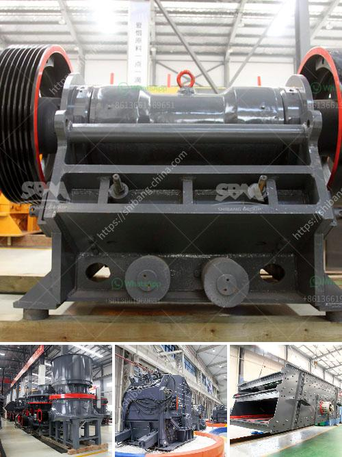

<h3>malaysia industrial mill</h3>
Malaysia, a blossoming Southeast Asian country, is home to a thriving industrial sector. Among the various industries, the industrial mill sector plays a crucial role in propelling Malaysia's economy forward. 

Industrial mills in Malaysia are instrumental in manufacturing a wide range of products, including textiles, chemicals, metals, and food products. These mills serve as the backbone of Malaysia's manufacturing industry, providing employment opportunities and contributing significantly to the country's GDP.

One key aspect that makes Malaysia's industrial mills successful is their strategic location. Malaysia is strategically located in the heart of Asia, making it an ideal hub for international trade. Its proximity to major shipping routes and access to regional markets enables industrial mills to efficiently import raw materials and export finished products. This advantageous geographic location has attracted numerous foreign investors, further boosting Malaysia's industrial mill sector.

Moreover, Malaysia boasts a skilled workforce that adds to the success of its industrial mills. The country's emphasis on education and training has resulted in a highly skilled talent pool, capable of adopting advanced technologies and practices. This proficiency contributes to the efficiency and productivity levels of Malaysia's industrial mills, making them globally competitive.

In recent years, Malaysia has also increasingly focused on sustainability and environmental preservation. Industrial mills in the country have adopted measures to reduce their carbon footprint and incorporate eco-friendly practices. For instance, the usage of renewable energy sources, such as solar power, has gained traction in many industrial mill facilities. This commitment to sustainability not only contributes to a greener future but also enhances the reputation of Malaysia's industrial mill sector on the global stage.

In conclusion, Malaysia's industrial mill sector plays a vital role in the country's economic growth. With its strategic location, skilled workforce, and commitment to sustainability, Malaysia sets the stage for continued success in the manufacturing industry. As the country continues to attract investments and adopt innovative practices, it is poised to become a leading player in the global industrial mill market.
<h3>Contact us</h3><ul><li><strong>Whatsapp:&nbsp;<a href="https://wa.me/8613661969651">+8613661969651</a></strong></li><li><a href="https://swt.shibang-china.com/?git&amp;zhl&amp;malaysia industrial mill"><strong>Online Service(chat now)</strong></a></li></ul><h3>Related</h3><ul><li><a href='diesel engines grinding mills south africa.md'>diesel engines grinding mills south africa</a></li><li><a href='ethiopia conveyor belt india.md'>ethiopia conveyor belt india</a></li><li><a href='crusher manufacturing companies in hong kong.md'>crusher manufacturing companies in hong kong</a></li><li><a href='vibrating classifiing screen.md'>vibrating classifiing screen</a></li><li><a href='ball mill manufacture in chennai.md'>ball mill manufacture in chennai</a></li></ul>