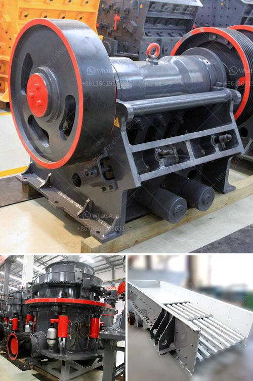

<h3>malaysia mineral ball mill</h3>
Malaysia is one of the leading countries in producing minerals, with a strong emphasis on tin, gold, and iron ore. Malaysia has also recently diversified its mineral industry by promoting the mining of other minerals like bauxite, copper, and manganese.

One of the main minerals mined in Malaysia is tin. Malaysia produces nearly one-third of the world's total tin supply, making it the largest tin producer globally. Tin mining has been a major industry in Malaysia for centuries, with large-scale operations taking place especially in the state of Perak. The tin is primarily used in the production of tin plates, tin cans, and other tin products.

To process the mined minerals, Malaysia utilizes various equipment and machinery, with one crucial machine being the mineral ball mill. A mineral ball mill is used to grind and blend materials for use in mineral processes, such as cement production, paints, pyrotechnics, ceramics, and selective laser sintering. The ball mill works on the principle of impact and attrition: the size reduction is done by impact as the balls drop from near the top of the shell.

The Malaysian mineral ball mill is a high-efficiency machine designed for grinding and mixing different types of minerals, such as iron ore, gold ore, copper ore, and bauxite. It is beneficial to the Malaysian economy as it not only allows the minerals to be processed efficiently but also attracts foreign investors looking to invest in Malaysia's mineral industry.

The mineral ball mill in Malaysia is equipped with various features that ensure minimal downtime and low maintenance costs. It is designed to have a long lifespan and operates with high stability and reliability. Manufacturers in Malaysia produce high-quality mineral ball mills that meet international standards, ensuring that the country remains competitive in the global mineral market.

In conclusion, Malaysia's mineral ball mill plays a significant role in the country's mineral industry. With its ability to grind and blend different types of minerals efficiently, it contributes to the overall economic growth of Malaysia. Furthermore, the high-quality mineral ball mills produced in Malaysia attract foreign investment, boosting the country's mineral industry and providing job opportunities for the local population.
<h3>Contact us</h3><ul><li><strong>Whatsapp:&nbsp;<a href="https://wa.me/8613661969651">+8613661969651</a></strong></li><li><a href="https://swt.shibang-china.com/?git&amp;zhl&amp;malaysia mineral ball mill"><strong>Online Service(chat now)</strong></a></li></ul><h3>Related</h3><ul><li><a href='equipment needed for coal mining.md'>equipment needed for coal mining</a></li><li><a href='stone crusher of mandibila in argentina.md'>stone crusher of mandibila in argentina</a></li><li><a href='rental mesin stone crusher.md'>rental mesin stone crusher</a></li><li><a href='how to make a stone breaker.md'>how to make a stone breaker</a></li><li><a href='price of industrial ball mills.md'>price of industrial ball mills</a></li></ul>