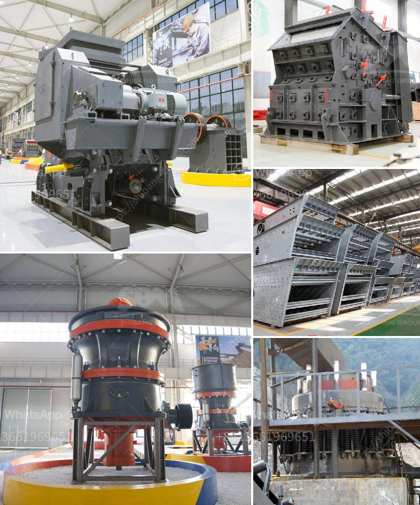

<h3>malaysia sand washer supplier</h3>
Malaysia, known for its beautiful beaches and abundant resources, has seen a rise in demand for sand washing equipment in recent years. As the construction industry continues to grow rapidly, the need for clean and high-quality sand has become essential, and sand washer suppliers play a crucial role in meeting this demand.

Sand washer suppliers in Malaysia have been working tirelessly to ensure that companies and individuals have access to the equipment they need to clean and purify sand effectively. These suppliers offer a range of sand washing machines, including spiral sand washers, bucket wheel sand washers, and vibrating sand washers, catering to different needs and preferences.

One of the key benefits of using sand washers is their ability to remove impurities and obtain clean sand ready for use in various applications. Whether it is for building projects, landscaping, or industrial purposes, clean sand is a valuable resource. Additionally, sand washers also play a crucial role in water conservation, as they can recycle water for further use in the washing process.

The suppliers in Malaysia understand the importance of providing reliable and durable sand washing equipment. They source their products from reputable manufacturers, ensuring that their customers receive top-quality machines that can withstand the demands of heavy use and challenging working conditions. Moreover, these suppliers often offer after-sales services, warranty options, and technical support to guarantee customer satisfaction.

In recent years, environmental concerns have become a key focus when it comes to sand washing processes. Sand washer suppliers in Malaysia have responded to these concerns by offering eco-friendly and energy-efficient machines. These sand washers are designed to minimize water and energy consumption, reducing the impact on the environment.

As the demand for sand washers continues to grow in Malaysia, suppliers are continuously expanding their product range and services to cater to a wider customer base. They understand the importance of providing innovative solutions that can meet the diverse needs of their clients.

In conclusion, Malaysia sand washer suppliers are playing a crucial role in meeting the rising demand for high-quality and clean sand. With their range of efficient and eco-friendly sand washing machines, they contribute to the growth and sustainability of the construction industry in Malaysia.
<h3>Contact us</h3><ul><li><strong>Whatsapp:&nbsp;<a href="https://wa.me/8613661969651">+8613661969651</a></strong></li><li><a href="https://swt.shibang-china.com/?git&amp;zhl&amp;malaysia sand washer supplier"><strong>Online Service(chat now)</strong></a></li></ul><h3>Related</h3><ul><li><a href='works cement grinding ball mill.md'>works cement grinding ball mill</a></li><li><a href='crushing complete crushing plant 80 120tph hard rock.md'>crushing complete crushing plant 80 120tph hard rock</a></li><li><a href='coal mill pulverizer in thermal power plant.md'>coal mill pulverizer in thermal power plant</a></li><li><a href='grinding machine its operation principle.md'>grinding machine its operation principle</a></li><li><a href='quarry crusher in nigeria.md'>quarry crusher in nigeria</a></li></ul>