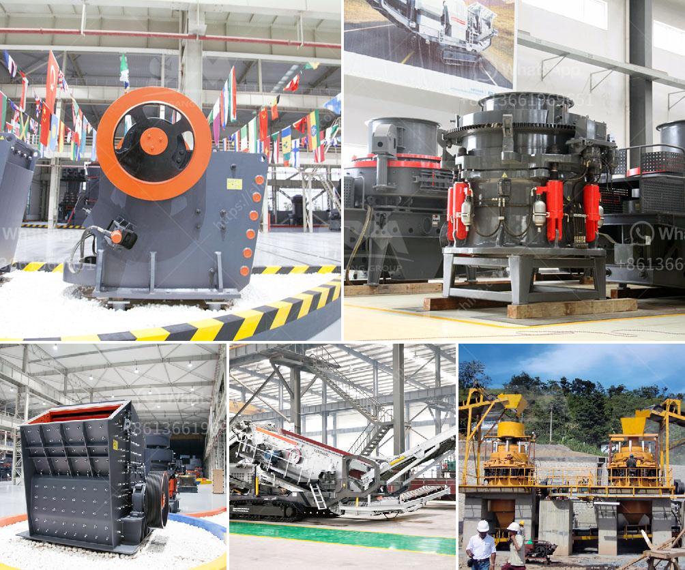

<h3>manufacturer of 30 80 mesh grinding plant</h3>
In the field of industrial grinding, finding a reliable and trustworthy manufacturer is crucial. A manufacturer that understands the specific needs and requirements of its customers can make all the difference in the success and efficiency of a grinding plant. One such manufacturer that time and again has proved its mettle is the manufacturer of 30-80 mesh grinding plant.

The manufacturer of 30-80 mesh grinding plant has been at the forefront of the industry for several years, providing exceptional service and high-quality products to its customers. With a team of experienced professionals and state-of-the-art technology, they have consistently delivered grinding plants that meet the highest standards of precision and performance.

One of the key strengths of the manufacturer is its commitment to customer satisfaction. They work closely with their clients to understand their specific requirements and develop customized solutions accordingly. From the initial consultation to the final delivery of the grinding plant, the manufacturer ensures that every step of the process is executed with utmost care and precision. This dedication to customer service sets them apart from their competitors.

When it comes to the quality of their products, the manufacturer leaves no stone unturned. They use only the finest quality materials and employ cutting-edge technology to develop grinding plants that deliver exceptional performance and durability. Each grinding plant undergoes rigorous testing and quality checks to ensure that it meets the highest industry standards. The manufacturer is also constantly investing in research and development to stay ahead of the curve and incorporate the latest advancements in the field.

Apart from their commitment to excellence, the manufacturer of 30-80 mesh grinding plant also offers competitive pricing and timely delivery. They understand the need for cost-effective solutions without compromising on quality and take pride in their ability to deliver grinding plants within the specified timelines.

In conclusion, the manufacturer of 30-80 mesh grinding plant is a reliable and reputable name in the industry. With their exceptional service, high-quality products, and customer-centric approach, they have earned the trust and loyalty of their clients. Whether it is for a small-scale operation or a large industrial project, customers can rely on the manufacturer for all their grinding plant needs. With them, success in the field of industrial grinding is just a step away.
<h3>Contact us</h3><ul><li><strong>Whatsapp:&nbsp;<a href="https://wa.me/8613661969651">+8613661969651</a></strong></li><li><a href="https://swt.shibang-china.com/?git&amp;zhl&amp;manufacturer of 30 80 mesh grinding plant"><strong>Online Service(chat now)</strong></a></li></ul><h3>Related</h3><ul><li><a href='hydraulic stone crusher for hire uk.md'>hydraulic stone crusher for hire uk</a></li><li><a href='to buy a coal wash plant in germany.md'>to buy a coal wash plant in germany</a></li><li><a href='marble powder micronizer plant in china.md'>marble powder micronizer plant in china</a></li><li><a href='suppliers of crush or rocks pretoria.md'>suppliers of crush or rocks pretoria</a></li><li><a href='prices for cheap roller mills in south africa.md'>prices for cheap roller mills in south africa</a></li></ul>