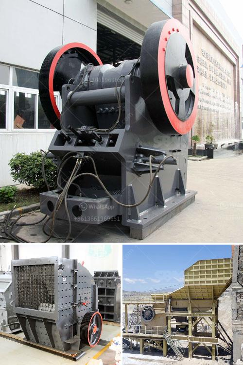

<h3>manufacturer of vibrating screens</h3>
In today's technologically advanced society, an increasing number of industries are relying on vibrating screens for their screening needs. Why? Because this essential equipment plays a crucial role in enhancing the productivity and efficiency of various processes. From mining and quarrying to pharmaceuticals and food production, vibrating screens are indispensable in many sectors. 

However, the key to achieving optimal results lies in selecting a reputable and reliable manufacturer of vibrating screens. With so many options available in the market, it is important to choose a manufacturer that understands the unique requirements of different industries and delivers high-performance solutions.

One such manufacturer that has become a trusted name in the industry is XYZ Screens. With years of experience and expertise, XYZ Screens has established itself as a leader in designing and manufacturing vibrating screens that cater to the diverse needs of its clients.

The primary objective of XYZ Screens is to provide customers with efficient screening solutions that streamline processes, improve product quality, and minimize downtime. To achieve this, the company employs state-of-the-art technologies and cutting-edge manufacturing techniques. This ensures that their vibrating screens are not only durable and reliable but also deliver exceptional performance and longevity.

XYZ Screens offers a wide range of vibrating screens, each tailored to suit specific applications. Whether it is the mining industry requiring heavy-duty screens for abrasive materials or the pharmaceutical industry demanding hygienic and sanitary designs, XYZ Screens has the expertise to meet these requirements. Their product portfolio includes linear motion screens, circular motion screens, elliptical motion screens, and more.

What sets XYZ Screens apart from its competitors is their commitment to innovation and customization. Their team of skilled engineers work closely with clients to understand their unique needs and challenges. They then develop customized solutions that address these specific requirements. XYZ Screens uses advanced 3D modeling and simulation software to create prototypes and optimize designs before manufacturing. This attention to detail ensures that their vibrating screens deliver optimal performance and maximum efficiency.

XYZ Screens understands the importance of after-sales service and support. They provide comprehensive maintenance and repair solutions to ensure that their equipment operates at peak performance throughout its lifespan. Additionally, their global network of service centers allows them to respond promptly to any issues or concerns raised by their clients, saving time and minimizing disruptions.

The success of XYZ Screens can be attributed to their unwavering commitment to quality, reliability, and customer satisfaction. By staying at the forefront of technological advancements and embracing innovation, they continue to revolutionize the vibrating screen industry.

In conclusion, choosing the right manufacturer of vibrating screens is essential for organizations looking to enhance their screening processes. With its cutting-edge technology, customization capabilities, and dedicated customer support, XYZ Screens has emerged as a trusted partner for industries across the globe. As the demand for efficient screening solutions grows, XYZ Screens remains committed to delivering innovative and high-performance vibrating screens that exceed customer expectations.
<h3>Contact us</h3><ul><li><strong>Whatsapp:&nbsp;<a href="https://wa.me/8613661969651">+8613661969651</a></strong></li><li><a href="https://swt.shibang-china.com/?git&amp;zhl&amp;manufacturer of vibrating screens"><strong>Online Service(chat now)</strong></a></li></ul><h3>Related</h3><ul><li><a href='mobile gold refinery for sale.md'>mobile gold refinery for sale</a></li><li><a href='fly ash electrostatic separator manufacturer.md'>fly ash electrostatic separator manufacturer</a></li><li><a href='speed in rollal mill.md'>speed in rollal mill</a></li><li><a href='crusher prices stone crusher primary and secondary.md'>crusher prices stone crusher primary and secondary</a></li><li><a href='rock screening plants usa.md'>rock screening plants usa</a></li></ul>