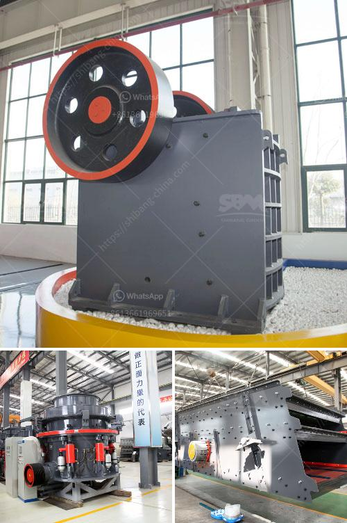

<h3>manufacturers of conveyor belts in malaysia</h3>
Conveyor belts are an essential tool in the material handling sector. They make transportation of goods and materials much more efficient and convenient. In Malaysia, numerous manufacturers specialize in the production of conveyor belts for various industries. These manufacturers play a crucial role in Malaysia's industrial growth and development.

One of the leading conveyor belt manufacturers in Malaysia is Al Kuwaiti Industrial Solutions. With their state-of-the-art manufacturing facility, they produce high-quality conveyor belts that are engineered to meet the specific requirements of different industries. Their conveyor belts are known for their durability, reliability, and efficient performance.

Another prominent manufacturer in Malaysia is Beltco (M) Sdn Bhd. They offer an extensive range of conveyor belts that cater to a diverse range of applications. Whether it's for the food industry, mining sector, or automotive industry, Beltco provides tailor-made conveyor belts that ensure smooth and seamless material transportation.

TCR Industrial Supplies is yet another reputable conveyor belt manufacturer in Malaysia. With their expertise and experience, they design and produce conveyor belts that are designed to withstand harsh working conditions and heavy loads. TCR Industrial Supplies' conveyor belts are built to last and provide efficient and trouble-free operation.

These manufacturers also offer additional services such as conveyor belt installation, maintenance, and repair. They have a team of highly skilled technicians who ensure that the conveyor belts are installed properly and function optimally. Regular maintenance and repair services help prolong the lifespan of the conveyor belts and prevent any potential issues that may arise.

In conclusion, the manufacturers of conveyor belts in Malaysia play a crucial role in supporting various industries by providing high-quality and efficient conveyor belts. Their products are essential for the smooth operation of material handling processes, improving productivity, and reducing downtime. With their expertise and dedication to customer satisfaction, these manufacturers contribute significantly to Malaysia's industrial growth.
<h3>Contact us</h3><ul><li><strong>Whatsapp:&nbsp;<a href="https://wa.me/8613661969651">+8613661969651</a></strong></li><li><a href="https://swt.shibang-china.com/?git&amp;zhl&amp;manufacturers of conveyor belts in malaysia"><strong>Online Service(chat now)</strong></a></li></ul><h3>Related</h3><ul><li><a href='cement crusher plant macheniary.md'>cement crusher plant macheniary</a></li><li><a href='high chrome impact crusher spare parts.md'>high chrome impact crusher spare parts</a></li><li><a href='stone crusher manufacturer in china.md'>stone crusher manufacturer in china</a></li><li><a href='used crusher for sale kenya.md'>used crusher for sale kenya</a></li><li><a href='how to make fly ash.md'>how to make fly ash</a></li></ul>