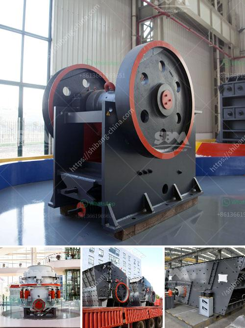

<h3>manufacturing and processing plant</h3>
In the modern industrial world, manufacturing and processing plants serve as the backbone of various sectors, including pharmaceuticals, food and beverage, automobile, and consumer goods. These facilities are the hub of production, transforming raw materials into finished products that are integral to our daily lives. This article will explore the significance of manufacturing and processing plants, their essential components, and the innovative advancements driving their efficiency.

Manufacturing and processing plants play a vital role in meeting the growing demands of consumers worldwide. They are responsible for converting raw materials into high-quality products efficiently and cost-effectively. Additionally, these plants contribute significantly to economic growth, job creation, and technological advancement.

Assembly lines are the heart of most manufacturing plants. They consist of a series of workstations, each dedicated to a specific task in the production process. These lines allow for efficient mass production by streamlining the workflow and reducing human error.

Maintaining product quality is of utmost importance. Sophisticated quality control and inspection systems ensure that the end products meet rigorous standards. Advanced machinery and software are employed to monitor various parameters such as weight, dimensions, and visual defects, ensuring consistent quality.

Material handling systems are employed to move raw materials, components, and finished goods throughout the manufacturing plant. These systems can utilize conveyors, automated guided vehicles (AGVs), or robotics, reducing human effort, increasing efficiency, and reducing the risk of damage.

Once the products are manufactured, they need to be packaged and prepared for shipment. Packaging machinery automates the process, ensuring items are packed securely, labeled correctly, and ready for distribution. High-tech logistics solutions are adopted to optimize the supply chain, ensuring products reach their destinations promptly.

The integration of automation and robotics has revolutionized manufacturing and processing plants. These technologies improve precision, reduce production time, and enhance worker safety. Robots are increasingly being used to perform repetitive tasks, allowing human labor to focus on complex operations.

IoT devices enable machines and equipment to communicate and exchange data in real time. This connectivity ensures better control and monitoring of plant operations and allows for timely preventive maintenance. IoT integration facilitates predictive analytics, optimizing production and reducing downtime.

AI and machine learning algorithms analyze vast amounts of data generated by manufacturing processes. This analysis aids in identifying patterns, optimizing production efficiency, and predicting machine failures in advance. Moreover, AI-powered robotics and guided decision-making systems increase accuracy, reduce waste, and enhance overall production outcomes.

Manufacturing and processing plants are the driving force behind many industries, supplying goods that improve our daily lives. The integration of advanced technologies has revolutionized these facilities, improving efficiency, quality, and sustainability. As the world moves towards an increasingly automated future, continuous innovation in the manufacturing and processing sector will undoubtedly shape the industrial landscape, meeting ever-growing consumer demands.
<h3>Contact us</h3><ul><li><strong>Whatsapp:&nbsp;<a href="https://wa.me/8613661969651">+8613661969651</a></strong></li><li><a href="https://swt.shibang-china.com/?git&amp;zhl&amp;manufacturing and processing plant"><strong>Online Service(chat now)</strong></a></li></ul><h3>Related</h3><ul><li><a href='how much does it cost to open a crusher stone plant.md'>how much does it cost to open a crusher stone plant</a></li><li><a href='coal seal of coal pulverizer.md'>coal seal of coal pulverizer</a></li><li><a href='calcium carbonate powder making equipment in germany.md'>calcium carbonate powder making equipment in germany</a></li><li><a href='how to start a cement factory.md'>how to start a cement factory</a></li><li><a href='mobile stone jaw crusher equipment.md'>mobile stone jaw crusher equipment</a></li></ul>