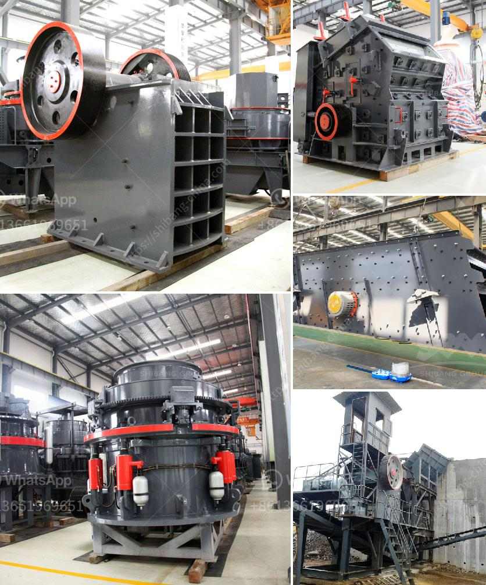

<h3>manufacturing from stone machine</h3>
In today's fast-paced world, technology is constantly evolving, with new innovations shaping the way we live and work. One such revolutionary innovation is the stone machine that has taken the manufacturing industry by storm. This cutting-edge equipment has transformed the way we produce various products, offering efficiency, precision, and sustainability like never before.

The stone machine, also known as a stone CNC machine or stone engraving machine, is specifically designed to process and manipulate natural stone materials with incredible accuracy. It combines the use of computer numerical control (CNC) technology, advanced software, and robotic arms to perform intricate tasks that were once labor-intensive and time-consuming.

One of the primary advantages of manufacturing from a stone machine is its ability to automate the production process, reducing the need for human labor. This not only saves time and resources but also minimizes the chances of error in the final product. Additionally, these machines can work round the clock, ensuring a constant flow of production, and meeting tight deadlines efficiently.

Another significant advantage of utilizing stone machines is precision. These sophisticated machines can achieve intricate designs, accurate measurements, and complex shapes with remarkable precision, ensuring consistent quality across all the pieces produced. Whether it is carving exquisite sculptures, architectural details, or personalized products, the stone machine can deliver exceptional results that surpass traditional craftsmanship.

Furthermore, stone machines are environmentally friendly and sustainable. They utilize advanced dust extraction systems to capture and control the stone dust generated during the manufacturing process, preventing pollution and maintaining a cleaner working environment. Additionally, the advanced software and automation reduce material waste, optimize cutting paths, and maximize the usage of raw materials, leading to cost savings and a smaller ecological footprint.

The flexibility of stone machines is yet another factor that makes them indispensable in the manufacturing industry. They can work on a wide range of stone materials, including granite, marble, limestone, and sandstone, catering to diverse requirements and design preferences. With the ability to switch between various cutting tools and customization options, the stone machine allows manufacturers to offer unique and bespoke products, meeting the demands of even the most discerning customers.

Manufacturing from stone machines also opens up new opportunities for businesses. By incorporating CAD/CAM software that translates intricate designs into machine-readable instructions, manufacturers can offer customization services, allowing customers to create personalized products. This versatility gives businesses a competitive edge and the potential for increased profitability.

In conclusion, the stone machine has revolutionized the manufacturing industry, offering a combination of efficiency, precision, and sustainability that was once unimaginable. With its ability to automate operations, achieve remarkable precision, and work on various stone materials, this state-of-the-art technology is transforming the way we produce custom products. As the demand for superior quality and unique designs continues to grow, the stone machine provides manufacturers with immense opportunities to thrive in the ever-evolving marketplace.
<h3>Contact us</h3><ul><li><strong>Whatsapp:&nbsp;<a href="https://wa.me/8613661969651">+8613661969651</a></strong></li><li><a href="https://swt.shibang-china.com/?git&amp;zhl&amp;manufacturing from stone machine"><strong>Online Service(chat now)</strong></a></li></ul><h3>Related</h3><ul><li><a href='vertical mill for slag grinding.md'>vertical mill for slag grinding</a></li><li><a href='aggregates crusher cebu.md'>aggregates crusher cebu</a></li><li><a href='buy stone crushing machine in kenya.md'>buy stone crushing machine in kenya</a></li><li><a href='kaolin crusher production costs.md'>kaolin crusher production costs</a></li><li><a href='vibratory ball mill china.md'>vibratory ball mill china</a></li></ul>