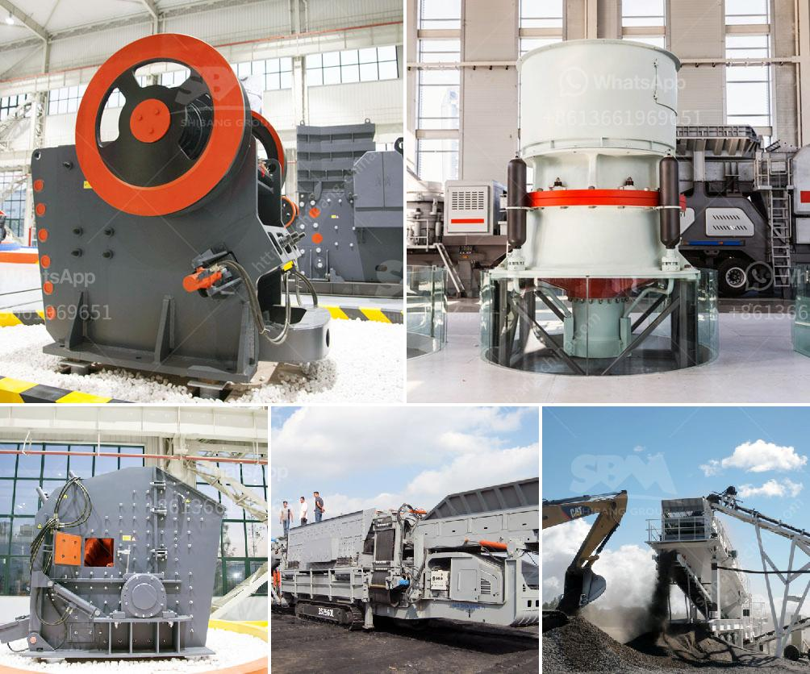

<h3>marble crusher for sale in portugal</h3>
Marble is a rock that forms through the natural process of heat and pressure being applied to limestone. It is a highly sought-after material for its beauty, durability, and versatility. Portugal is known for its rich marble resources, and many quarries in the country produce high-quality marble products.

For those who are looking to purchase marble products in Portugal, there are various options available. One of the most popular choices is a marble crusher, which can effectively grind large pieces of marble into smaller particles. Marble crusher machines are in high demand in the construction industry due to their ability to crush marble into desirable sizes.

Today, we will discuss the benefits of owning a marble crusher in Portugal and where to find one for sale. Firstly, having your own marble crusher allows you to process larger quantities of marble at a faster pace. This can be especially advantageous for contractors or businesses that require a significant amount of marble for their projects.

Furthermore, a marble crusher can help you save money in the long run. Rather than purchasing marble products from a third-party supplier, owning a crusher enables you to produce your own crushed marble at a lower cost. This can lead to substantial savings, especially for larger-scale projects or ongoing marble processing needs.

When it comes to finding a marble crusher for sale in Portugal, there are a few options to consider. One option is to look for suppliers or manufacturers that specialize in marble crushers. These companies often have a wide range of crusher models to choose from, making it easier to find the right one for your specific needs.

Additionally, online marketplaces and auction websites can be a valuable resource for finding used marble crushers for sale. These platforms allow you to browse through various listings and compare prices from different sellers. However, it is important to conduct thorough research and inspect the equipment before making a purchase to ensure its quality and performance.

Furthermore, reaching out to industry associations or attending trade shows can provide valuable insights and connections to potential sellers of marble crushers. These events often bring together professionals from the construction and quarrying industries, allowing you to network and explore different purchasing options.

In conclusion, a marble crusher can be a valuable asset for those looking to process and crush marble efficiently. Portugal, with its abundant marble resources, provides an ideal market for such equipment. Owning a marble crusher can offer numerous benefits, including cost savings and increased productivity. Whether you choose to purchase one from a specialized supplier, online platform, or through industry connections, investing in a high-quality marble crusher can be a wise decision for businesses and individuals alike.
<h3>Contact us</h3><ul><li><strong>Whatsapp:&nbsp;<a href="https://wa.me/8613661969651">+8613661969651</a></strong></li><li><a href="https://swt.shibang-china.com/?git&amp;zhl&amp;marble crusher for sale in portugal"><strong>Online Service(chat now)</strong></a></li></ul><h3>Related</h3><ul><li><a href='price for stone crusher machine.md'>price for stone crusher machine</a></li><li><a href='project cost to manufacture 200 tpd cement in in nepal.md'>project cost to manufacture 200 tpd cement in in nepal</a></li><li><a href='crushers manufactures in.md'>crushers manufactures in</a></li><li><a href='iron ore crushed machine second hand.md'>iron ore crushed machine second hand</a></li><li><a href='portable crushing and screening plant.md'>portable crushing and screening plant</a></li></ul>