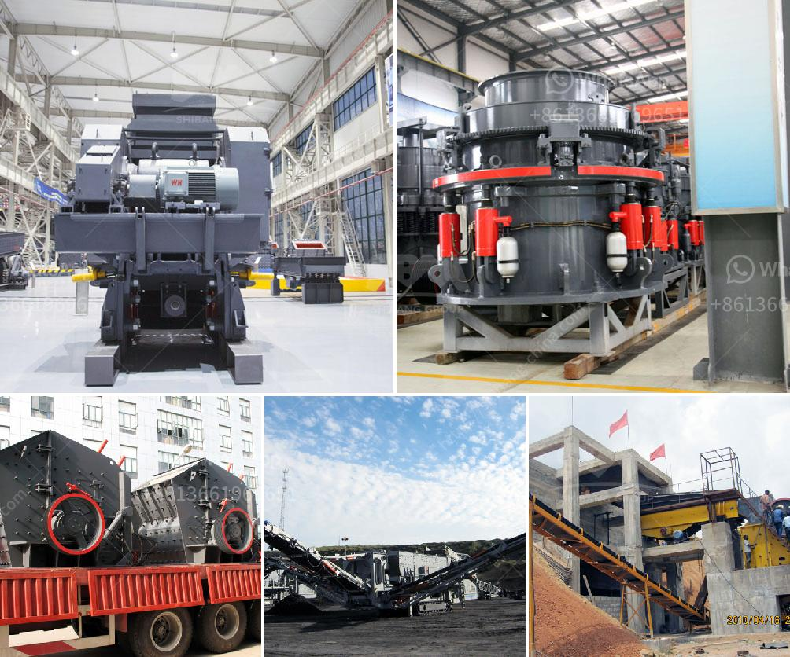

<h3>marble powder micronizer plant in china</h3>
China is known for its diverse range of manufacturing plants and industries. One such industry that has seen significant growth in recent years is the marble powder micronizer plant. These plants play a crucial role in the production of marble powder, which is widely used in various applications such as construction, cosmetics, and agriculture.

Marble powder micronizer plants are specialized plants that use cutting-edge technology to grind marble into a fine powder. This powder is then used in various industries, providing a cost-effective and sustainable alternative to natural resources. China, with its vast marble reserves, has emerged as a global leader in marble powder production.

One of the key advantages of marble powder micronizer plants in China is their ability to produce high-quality powder with a consistent particle size distribution. The advanced equipment and machinery used in these plants ensure that the marble is ground to the desired fineness, meeting the specific requirements of various industries. This not only enhances the quality of the end product but also improves the overall efficiency of the manufacturing process.

Another significant advantage of marble powder micronizer plants in China is their environmental sustainability. By utilizing marble waste, these plants contribute to a circular economy by reducing the demand for natural resources and minimizing the amount of waste generated. The marble industry generates a substantial amount of waste during the mining and processing stages. However, through advanced techniques and processes, these waste materials are effectively converted into valuable products, reducing the environmental impact and creating a more sustainable industry.

Furthermore, the marble powder produced by these plants has several applications across different industries. In the construction sector, it can be used as a partial replacement for cement, providing enhanced strength and durability to concrete structures. Additionally, the powder is also used in the cosmetic industry for the production of skincare products and makeup. It acts as a natural exfoliant, providing a gentle yet effective way to remove dead skin cells and promote a healthy glow. Moreover, marble powder is widely used in agriculture as a soil amendment, improving soil structure and nutrient availability.

China's marble powder micronizer plants have not only revolutionized the marble industry but have also contributed to the country's economic growth. These plants provide employment opportunities to thousands of workers, both directly and indirectly. Moreover, by exporting marble powder to other countries, China has established itself as a global player in this specialized industry.

In conclusion, the marble powder micronizer plants in China have brought significant advancements to the marble industry. With their advanced technology and sustainable practices, these plants produce high-quality marble powder that finds applications in various sectors. Furthermore, they contribute to a circular economy by utilizing waste materials and reducing environmental impact. These plants have not only transformed the marble industry but have also made China a leading player in the global market for marble powder production.
<h3>Contact us</h3><ul><li><strong>Whatsapp:&nbsp;<a href="https://wa.me/8613661969651">+8613661969651</a></strong></li><li><a href="https://swt.shibang-china.com/?git&amp;zhl&amp;marble powder micronizer plant in china"><strong>Online Service(chat now)</strong></a></li></ul><h3>Related</h3><ul><li><a href='vertical roller mill maintenance pdf.md'>vertical roller mill maintenance pdf</a></li><li><a href='sand wash plants for sale in texas.md'>sand wash plants for sale in texas</a></li><li><a href='manufacturers of conveyor belts in malaysia.md'>manufacturers of conveyor belts in malaysia</a></li><li><a href='300 tph cone crusher price.md'>300 tph cone crusher price</a></li><li><a href='concrete and stone crushing machines in kenya.md'>concrete and stone crushing machines in kenya</a></li></ul>