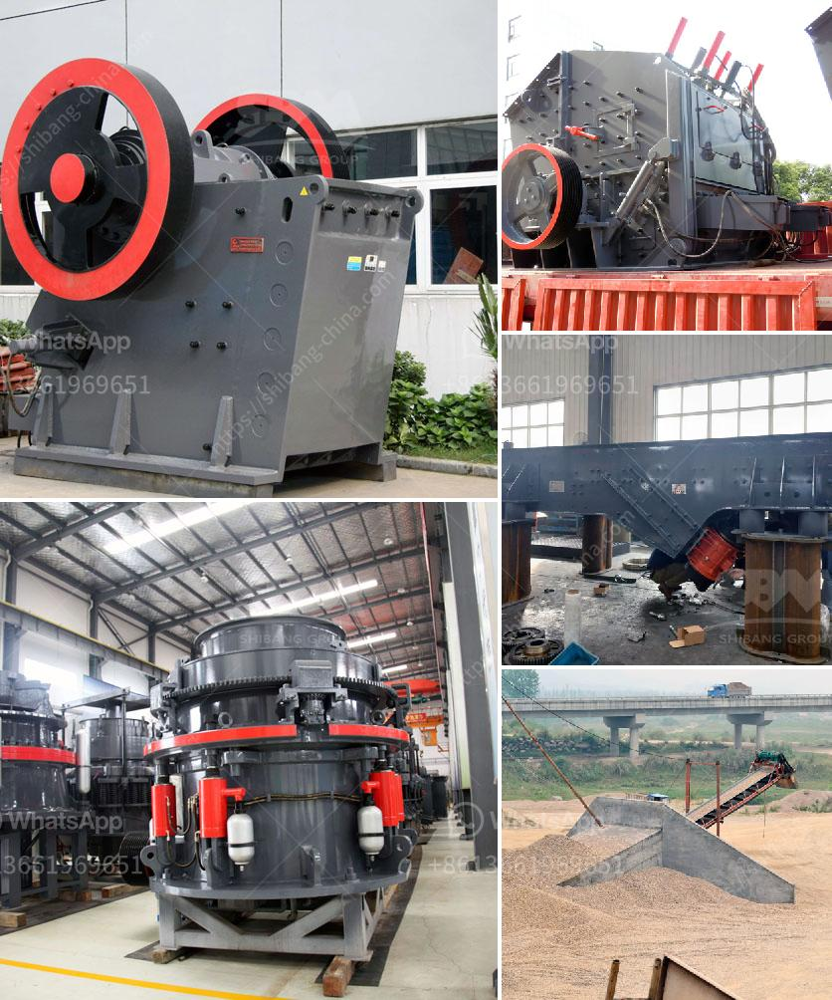

<h3>material used in vertical mill</h3>
The vertical mill is a type of industrial equipment used to crush or grind materials into small particles. It is widely used in the concrete and mining industries due to its high efficiency and low power consumption. In order to ensure the quality and performance of vertical mills, it is essential to choose the right materials.

One of the primary materials used in vertical mills is steel. Steel is known for its strength and durability, making it suitable for heavy-duty applications. In vertical mills, steel components such as grinding discs, liners, and classifier housings are exposed to intense wear and tear. Therefore, high-quality steel with excellent corrosion resistance and hardness is preferred for these parts. Additionally, steel components need to be properly heat-treated to enhance their strength and prolong their lifespan.

Another crucial material used in vertical mills is cast iron. Cast iron is commonly used for components that require high strength and stability, such as the mill body and support frame. It has excellent vibration damping properties, which helps reduce noise and vibration during operation. Cast iron is also resistant to wear and abrasion, making it suitable for heavy-duty applications.

In some cases, vertical mills may use non-metallic materials, such as ceramics or composites, for certain components. Ceramics offer exceptional hardness and wear resistance, making them ideal for grinding media and wear parts. They are also chemically inert and can withstand high temperatures, making them suitable for processing abrasive and high-temperature materials.

Composites, consisting of a combination of different materials, may also be used in vertical mills. For instance, carbon fiber-reinforced polymers (CFRP) are known for their high strength-to-weight ratio, making them ideal for lightweight components. CFRP can be used for parts such as rotor blades and guide vanes, contributing to the overall efficiency and performance of the mill.

In recent years, there has been a growing interest in using recycled materials in vertical mills. The use of recycled materials not only reduces waste and conserves resources but also offers cost savings. For instance, recycled steel can be used to manufacture various components, reducing the reliance on virgin materials.

In conclusion, the choice of materials used in vertical mills plays a vital role in their performance and durability. Steel and cast iron are commonly used for their strength and wear resistance, while ceramics and composites offer unique properties for specialized applications. With the increasing focus on sustainability, the use of recycled materials is also gaining attention in the industry. By selecting the appropriate materials, manufacturers can ensure that vertical mills deliver optimal performance and efficiency in various industrial operations.
<h3>Contact us</h3><ul><li><strong>Whatsapp:&nbsp;<a href="https://wa.me/8613661969651">+8613661969651</a></strong></li><li><a href="https://swt.shibang-china.com/?git&amp;zhl&amp;material used in vertical mill"><strong>Online Service(chat now)</strong></a></li></ul><h3>Related</h3><ul><li><a href='harga jaw crusher.md'>harga jaw crusher</a></li><li><a href='graphite ore buyers in india.md'>graphite ore buyers in india</a></li><li><a href='crusher specification.md'>crusher specification</a></li><li><a href='superfine grinding mills in shanhgai.md'>superfine grinding mills in shanhgai</a></li><li><a href='vertical mill for calcite.md'>vertical mill for calcite</a></li></ul>