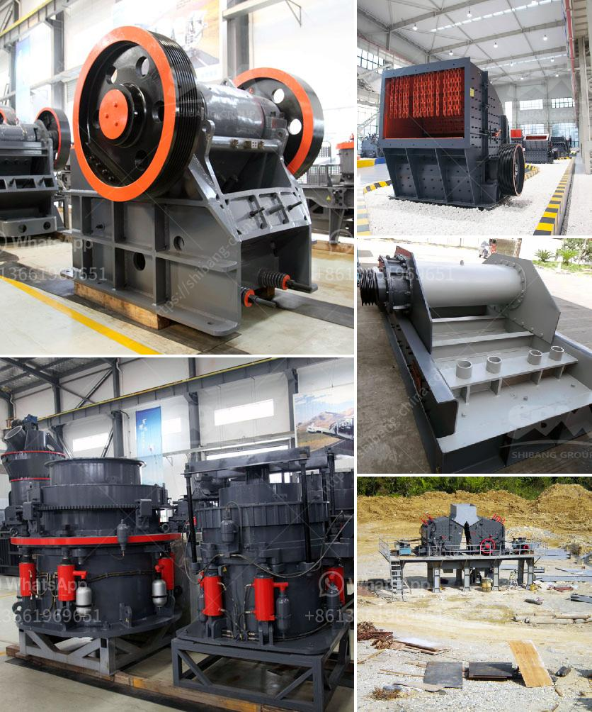

<h3>mica crusher production plants</h3>
Mica is a mineral that has various applications in different industries, including construction, cosmetics, paint, and electronics. In order to extract mica, it needs to be crushed into smaller particles. Therefore, a mica crusher production plant plays a crucial role in the process.

Mica ore is usually found in the form of sheets or flakes that can be easily separated. However, before it can be used in various applications, it needs to undergo a crushing process. A mica crusher production plant is a machine that is utilized to crush mica into smaller particles. It is designed to reduce the size and volume of raw mica material to the desired output size.

The mica crusher production plants are typically mobile or portable and can be easily moved around to various locations. This allows for flexibility in the production process, as the plant can be brought closer to the mining site, minimizing transportation costs. Additionally, these plants are equipped with advanced crushing machinery that ensures efficient and high-quality mica processing.

The output size of the crushed mica material can be adjusted according to the specific requirements of different industries. This flexibility is crucial, as mica is used in various applications that demand different particle sizes. The mica crusher production plants have the ability to produce mica particles ranging from coarse to fine, ensuring they meet industry specifications.

Furthermore, these plants are designed to handle large volumes of mica, making them suitable for commercial-scale production. With capacities ranging from 100 to 300 tons per hour, they can cater to the high demands of industries that heavily rely on mica for their operations.

In conclusion, mica crusher production plants are essential in the mica processing industry. They allow for efficient and flexible crushing of mica ore, producing different particle sizes to meet the requirements of various industries. With their mobility and high production capacity, these plants play a crucial role in supporting the supply of mica to industries worldwide.
<h3>Contact us</h3><ul><li><strong>Whatsapp:&nbsp;<a href="https://wa.me/8613661969651">+8613661969651</a></strong></li><li><a href="https://swt.shibang-china.com/?git&amp;zhl&amp;mica crusher production plants"><strong>Online Service(chat now)</strong></a></li></ul><h3>Related</h3><ul><li><a href='chrome ore refinery processing plant.md'>chrome ore refinery processing plant</a></li><li><a href='cost of crusher plant.md'>cost of crusher plant</a></li><li><a href='granite quarry crushing plant.md'>granite quarry crushing plant</a></li><li><a href='concrete jaw crusher.md'>concrete jaw crusher</a></li><li><a href='small scale mining plant philippines diagram.md'>small scale mining plant philippines diagram</a></li></ul>