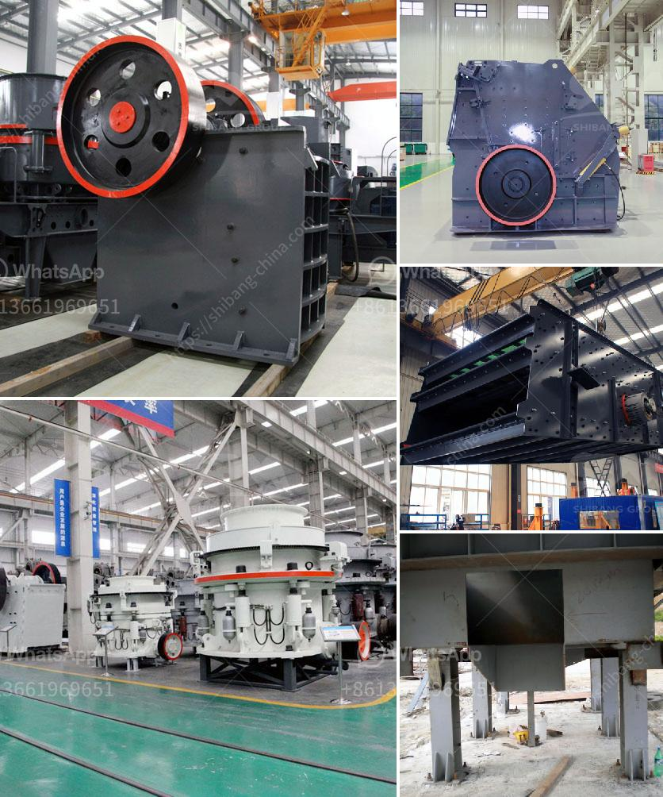

<h3>mica processing plant</h3>
Mica is a naturally occurring mineral known for its unique properties and wide range of applications. It is primarily used in industries such as cosmetics, paints, plastics, electronics, and construction. Mica processing plants are essential to the extraction and refining of this valuable mineral.

Mica processing involves several steps, including mining, pulverizing, refining, and packaging. To begin the process, mica deposits are extracted through conventional mining techniques. This involves the use of heavy machinery and explosives to remove large deposits of mica from the earth's crust.

Once the mica is extracted, it is then pulverized into smaller particles to enhance its purity and quality. This can be done through various methods, including crushing, grinding, and screening. The pulverized mica is then passed through several stages of refining, where impurities are removed to achieve the desired quality.

Refining processes often involve the use of chemicals and advanced technologies to purify the mica further. This helps to remove any remaining impurities, such as minerals, organic matter, and other contaminants. The refined mica is then carefully tested to meet industry standards and specifications.

After refining, the mica is ready for packaging and distribution. It is commonly packaged in bags or containers to ensure its safe transport and storage. Proper packaging helps to maintain the quality and integrity of the mica, protecting it from moisture, dust, and other external factors that may affect its properties.

Mica processing plants play a crucial role in meeting the increasing demand for mica worldwide. These facilities provide a centralized location for efficient and cost-effective processing of the mineral. They also help to create job opportunities and stimulate local economies in areas where mica deposits are abundant.

In addition to its economic importance, mica processing plants need to prioritize environmental sustainability. The extraction and processing of mica can have significant impacts on the environment if not managed properly. Therefore, responsible mining practices, waste management, and water conservation techniques must be implemented to minimize these effects.

Many mica processing plants are adopting sustainable practices, such as using renewable energy sources, minimizing water usage, and implementing waste management strategies. This helps to reduce the carbon footprint of the operations and ensures the preservation of natural resources for future generations.

In conclusion, mica processing plants are instrumental in the extraction, refining, and packaging of this valuable mineral. They play a vital role in meeting the global demand for mica across various industries. By adopting sustainable practices, these plants can contribute to environmental preservation while supporting economic growth in the regions where they operate.
<h3>Contact us</h3><ul><li><strong>Whatsapp:&nbsp;<a href="https://wa.me/8613661969651">+8613661969651</a></strong></li><li><a href="https://swt.shibang-china.com/?git&amp;zhl&amp;mica processing plant"><strong>Online Service(chat now)</strong></a></li></ul><h3>Related</h3><ul><li><a href='talcum powder machine.md'>talcum powder machine</a></li><li><a href='old used coal washing plants.md'>old used coal washing plants</a></li><li><a href='slag powder machine.md'>slag powder machine</a></li><li><a href='stone crusher machinery manufacturers.md'>stone crusher machinery manufacturers</a></li><li><a href='list of limestone mining companies in china.md'>list of limestone mining companies in china</a></li></ul>