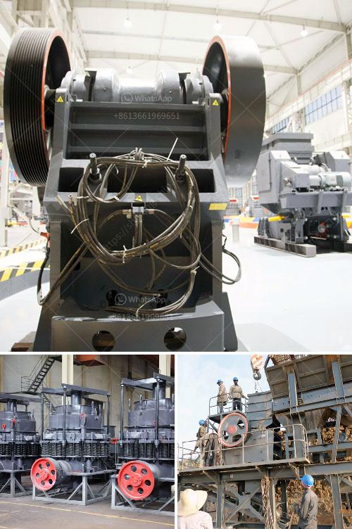

<h3>micro grinding machine</h3>
Precision machining plays a crucial role in various industries, particularly in the production of intricate and delicate components. One technology that has revolutionized precision machining is the micro grinding machine. With its high precision and advanced capabilities, this machine has become a cornerstone in the manufacturing processes of various industries.

Micro grinding machines are highly versatile and can be used in a wide array of industries, such as aerospace, automotive, electronics, energy, medical, and defense. These machines are designed to achieve highly accurate and precise results, with minimal operator intervention.

The key feature of a micro grinding machine is its compact size, which allows it to fit in tight spaces and work on small components. This is essential in industries that require intricate and complex parts, as traditional grinding machines are often too large and cumbersome for such tasks.

One of the main advantages of micro grinding machines is their ability to operate at high speeds with high precision. By using advanced technologies, such as high-frequency spindles and advanced control systems, these machines can achieve nanometer-level accuracies. This level of precision is crucial in industries such as medical and aerospace, where even the slightest deviation can have significant consequences.

Micro grinding machines also offer enhanced flexibility. With the ability to program complex grinding operations, these machines can easily adapt to different component profiles and requirements. This flexibility allows manufacturers to produce a wide range of parts, from small and intricate pieces to larger components.

A significant benefit of micro grinding machines is their efficiency in material removal. Through their high rotational speeds and advanced grinding technologies, these machines can remove material at a faster rate compared to traditional machining processes. This results in reduced production times and increased productivity for manufacturers.

Another advantage of micro grinding machines is their superior surface finish. With their precise control over grinding parameters, these machines can produce parts with extremely smooth surfaces. This is particularly important in industries such as optics and electronics, where surface finish is critical for functionality and performance.

Despite their numerous advantages, micro grinding machines are not without challenges. The small size of the machines and the components they work on require careful handling and positioning. The high rotational speeds and forces involved also necessitate robust machine construction and high-quality materials.

In conclusion, micro grinding machines have revolutionized precision machining with their advanced capabilities and versatility. These machines offer high precision, efficiency, flexibility, and superior surface finish, making them invaluable in various industries. As technology continues to advance, further innovations in micro grinding machines are expected, leading to even greater precision and productivity in the manufacturing sector.
<h3>Contact us</h3><ul><li><strong>Whatsapp:&nbsp;<a href="https://wa.me/8613661969651">+8613661969651</a></strong></li><li><a href="https://swt.shibang-china.com/?git&amp;zhl&amp;micro grinding machine"><strong>Online Service(chat now)</strong></a></li></ul><h3>Related</h3><ul><li><a href='cement grinding mill price invest cost.md'>cement grinding mill price invest cost</a></li><li><a href='mobile crusher algerie.md'>mobile crusher algerie</a></li><li><a href='stones crushing into building sand.md'>stones crushing into building sand</a></li><li><a href='copper processing equipment.md'>copper processing equipment</a></li><li><a href='concrete stone crusher machine for sale in south africa.md'>concrete stone crusher machine for sale in south africa</a></li></ul>