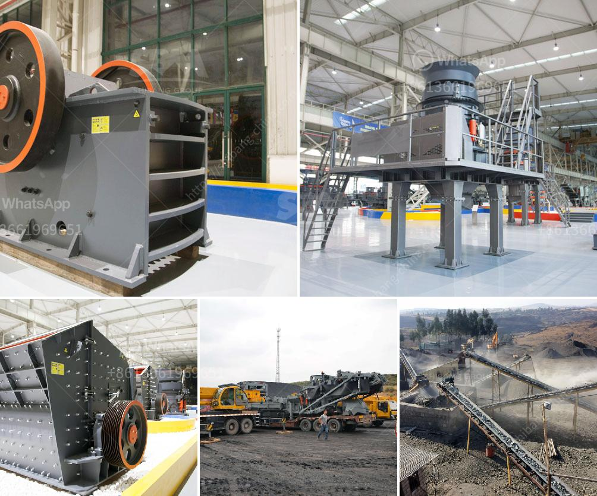

<h3>milling and grinding machine</h3>
Milling and grinding machines are two essential machines utilized in various production lines and manufacturing plants. Due to their extensive applications, these machines have been classified into various categories, each specializing in a particular task or material. 

Milling machines, often referred to as mills, are utilized to remove excess material from various workpieces, ensuring a smooth and precise finish. These machines feature rotating cutters that remove the material through advanced cutting techniques. Mills are suitable for a wide range of materials, including metal, wood, plastic, and even ceramics. They allow for precision cutting, drilling, and shaping, making them indispensable in industries such as automotive, aerospace, and construction. 

Grinding machines, on the other hand, focus on achieving fine, accurate finishes, thereby serving an essential role in applications where smoothness and precision are necessary. These machines typically utilize a grinding wheel to remove material through abrasion. Grinding machines are primarily used for finishing materials, especially metallic ones. They are used across various industries, including automotive, aerospace, medical, and electronics. 

Both milling and grinding machines come in various sizes, from benchtop models to large-scale industrial machines. The range of functionalities provided by these machines make them essential in various industries and manufacturing processes. Milling machines are often used for prototyping and small-scale production, while grinding machines are ideal for large-scale production. 

As technology advances, milling and grinding machines continue to improve in terms of precision, speed, and efficiency. Computer numerical control (CNC) technology has further enhanced these machines, allowing for automated operations, increased productivity, and reduced human errors. CNC machines provide precise and consistent results, making them invaluable in high-end manufacturing processes. 

In conclusion, milling and grinding machines are indispensable machines in modern production lines, serving different purposes yet contributing to the overall efficiency and quality of finished products. These machines have evolved with technological advancements, making them more precise and efficient in their respective functions. As industries continue to evolve, milling and grinding machines will likely play an even more significant role in meeting the demands of various manufacturing processes.
<h3>Contact us</h3><ul><li><strong>Whatsapp:&nbsp;<a href="https://wa.me/8613661969651">+8613661969651</a></strong></li><li><a href="https://swt.shibang-china.com/?git&amp;zhl&amp;milling and grinding machine"><strong>Online Service(chat now)</strong></a></li></ul><h3>Related</h3><ul><li><a href='rock screening plants.md'>rock screening plants</a></li><li><a href='harga mesin raymond mill indonesia.md'>harga mesin raymond mill indonesia</a></li><li><a href='used crushing plant in sweden or norwey.md'>used crushing plant in sweden or norwey</a></li><li><a href='aggregate production process.md'>aggregate production process</a></li><li><a href='malaysia industrial mill.md'>malaysia industrial mill</a></li></ul>