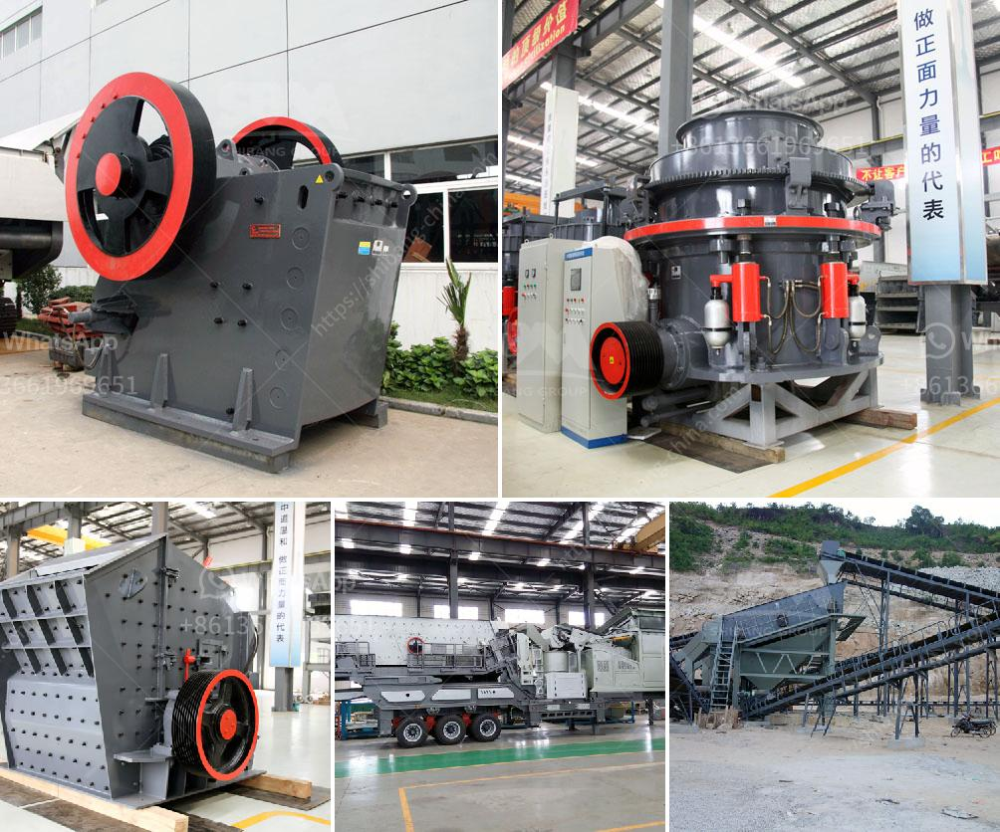

<h3>mine to mill optimization and reconciliation</h3>
Mine-to-mill optimization and reconciliation is a technique used in the mining industry to enhance operational efficiency and maximize profitability. The approach involves integrating and optimizing different stages of the mining process, from ore extraction at the mine site to the mill processing plant.

The main objective of mine-to-mill optimization is to ensure that the optimal amount of valuable minerals or metals are extracted from the mined ore. By closely linking mine and mill operations, it allows for better coordination and improved decision-making. This approach considers various factors such as ore characteristics, drilling and blasting techniques, fragmentation, and equipment performance.

Reconciliation, on the other hand, refers to the process of comparing the planned and actual production of minerals. It involves analyzing data and identifying any discrepancies, ensuring that the operation is running in line with expectations. Reconciliation is crucial for resource estimation, mine planning, and financial reporting.

The integration of mine-to-mill optimization and reconciliation can result in numerous benefits. It helps reduce costs by minimizing unnecessary processes, energy consumption, and equipment wear. By improving the accuracy of resource estimates, it becomes easier to plan production targets and optimize fleet deployment. Additionally, the concerted effort between the mine and mill teams leads to better communication, collaboration, and overall productivity.

To implement this approach successfully, advanced technologies such as data analytics, artificial intelligence, and automation are often employed. These technologies enable real-time monitoring, in-depth analysis, and predictive modeling, aiding in decision-making and process improvements.

In conclusion, mine-to-mill optimization and reconciliation are vital tools in the mining industry to achieve maximum efficiency and profitability. By closely linking mine and mill operations and continuously monitoring and analyzing data, mining companies can streamline their processes, reduce costs, and enhance productivity. This integrated approach, coupled with advanced technologies, will undoubtedly contribute to the sustainable growth and success of the mining industry.
<h3>Contact us</h3><ul><li><strong>Whatsapp:&nbsp;<a href="https://wa.me/8613661969651">+8613661969651</a></strong></li><li><a href="https://swt.shibang-china.com/?git&amp;zhl&amp;mine to mill optimization and reconciliation"><strong>Online Service(chat now)</strong></a></li></ul><h3>Related</h3><ul><li><a href='conveyor belts in zambia.md'>conveyor belts in zambia</a></li><li><a href='copper ore processing.md'>copper ore processing</a></li><li><a href='supplier of grinding stone.md'>supplier of grinding stone</a></li><li><a href='drywall recycling machine sales.md'>drywall recycling machine sales</a></li><li><a href='latest stone crusher machine price india.md'>latest stone crusher machine price india</a></li></ul>