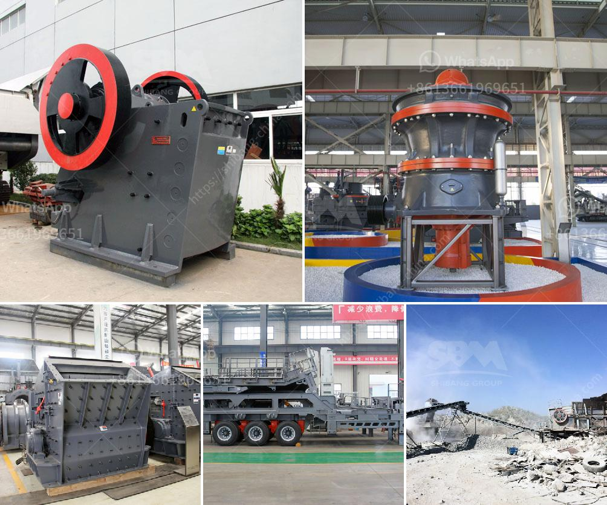

<h3>mineral material crusher</h3>
In the field of mining, mineral crushers are essential pieces of equipment. Crushers are used to crush large rocks, minerals, and other materials into smaller particles for further processing or to extract valuable minerals. With the continuous advancements in technology, crushers have also evolved to become more efficient and versatile in fulfilling their role in the mining industry.

One of the key advancements in the field of mineral crushers is the development of the mineral material crusher. This type of crusher is specifically designed to handle mineral materials, such as ores, rocks, and minerals, making it a valuable asset for the mining industry.

One of the primary advantages of the mineral material crusher is its ability to crush mineral materials with hardness levels ranging from soft to hard. This adaptability allows the crusher to process a wide range of materials, making it suitable for various mining operations. For instance, in open-pit mining, the mineral material crusher can handle both soft and hard materials found in the mining site.

In addition to its ability to crush a wide range of materials, the mineral material crusher is also equipped with advanced features that enhance its performance. For example, many crushers now come with hydraulic systems that allow for easy adjustment of the crusher's settings, such as the gap between the crushing plates. This feature allows for precise control over the size of the crushed material, ensuring consistent quality and maximizing the extraction of valuable minerals.

Another notable feature of the mineral material crusher is its high efficiency. With its powerful motor and innovative design, the crusher can process large quantities of material in a relatively short period. This not only improves productivity but also reduces energy consumption, making the crusher a more environmentally friendly option.

Furthermore, the mineral material crusher is designed to withstand the harsh conditions typically encountered in mining operations. Its robust construction ensures its durability, enabling it to operate reliably even in the harshest mining environments. Additionally, many crushers are equipped with advanced dust suppression systems, reducing dust emissions and improving the overall safety and health conditions for workers.

The mineral material crusher plays a crucial role in the mining industry, enabling the extraction and processing of valuable minerals. Without efficient crushers, mining operations would be significantly hindered, limiting the industry's ability to meet the growing demand for minerals. Therefore, the continuous advancements in the design and performance of these crushers are vital to the sustainable growth of the mining industry.

In conclusion, the mineral material crusher is an essential piece of equipment in the mining industry. Its ability to handle a wide range of materials, its high efficiency, and its durability make it a valuable asset for any mining operation. As technology continues to advance, we can expect further improvements in the design and performance of these crushers, ensuring the continuous advancement of the mining industry.
<h3>Contact us</h3><ul><li><strong>Whatsapp:&nbsp;<a href="https://wa.me/8613661969651">+8613661969651</a></strong></li><li><a href="https://swt.shibang-china.com/?git&amp;zhl&amp;mineral material crusher"><strong>Online Service(chat now)</strong></a></li></ul><h3>Related</h3><ul><li><a href='ton per day gold processing plant.md'>ton per day gold processing plant</a></li><li><a href='cement plant cost estimation cement plant cost.md'>cement plant cost estimation cement plant cost</a></li><li><a href='cone crushers manufacturers.md'>cone crushers manufacturers</a></li><li><a href='traditional crushing machine.md'>traditional crushing machine</a></li><li><a href='crusher equipment price.md'>crusher equipment price</a></li></ul>