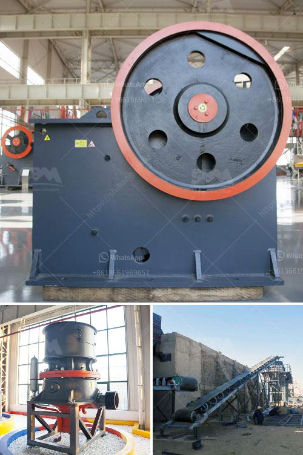

<h3>mineral processing plants china</h3>
Mineral processing plants in China have come a long way in terms of technological advancements and efficiency. With abundant mineral resources, China has been a leading player in the global mineral processing industry. These plants play a crucial role in extracting valuable minerals from ores and transforming them into usable products.

China is known for its rich deposits of minerals such as coal, iron ore, copper, gold, rare earth elements, and many others. The country's vast mineral resources have made it a global powerhouse in the mining and processing sector. Mineral processing plants in China are equipped with state-of-the-art technology and machinery to ensure optimum extraction and processing of minerals.

Efficiency is a critical factor in mineral processing plants in China. With the increasing demand for various minerals worldwide, it is essential to process ores quickly and efficiently. China has made significant investments in developing and implementing advanced technologies to enhance productivity and reduce environmental impacts.

One area where China has excelled is in the development and adoption of advanced processing techniques. These techniques include crushing, grinding, flotation, magnetic separation, and leaching, among others. These processes aim to separate valuable minerals from the ore and produce concentrate products.

For instance, in the case of gold processing, China has made impressive strides in adopting advanced technologies such as cyanide leaching and carbon-in-pulp (CIP). These techniques have revolutionized gold extraction and significantly improved efficiency and recovery rates.

China's mineral processing plants are also increasingly adopting automation and digitization technologies. These advancements allow for remote monitoring, optimization of processes, and real-time data analysis. Automation helps reduce human errors, improves safety, and increases overall efficiency in plant operations.

Environmental sustainability is a top priority in China's mineral processing industry. As awareness about the environmental impacts of mining grows, China has implemented strict regulations and standards to minimize pollution and protect the environment. Mineral processing plants are equipped with cutting-edge pollution control technologies to ensure compliance with environmental regulations.

China's mineral processing plants also play a significant role in the country's economic development. These plants create employment opportunities and contribute to local economies. Moreover, the processed minerals are crucial inputs for various industries, including manufacturing, construction, and energy production, which drive economic growth.

China's dominance in the global mineral processing industry has also spurred international collaborations and partnerships. Chinese companies have invested in mineral processing plants in other countries and have shared their technological expertise. Through these collaborations, China has been able to expand its presence in the international market and establish itself as a leader in mineral processing.

In conclusion, China's mineral processing plants have undergone remarkable advancements and are at the forefront of the global industry. These plants utilize advanced technologies, prioritize efficiency, and comply with strict environmental regulations. With its vast mineral resources and technologically advanced processing plants, China continues to play a crucial role in meeting the world's growing demand for minerals.
<h3>Contact us</h3><ul><li><strong>Whatsapp:&nbsp;<a href="https://wa.me/8613661969651">+8613661969651</a></strong></li><li><a href="https://swt.shibang-china.com/?git&amp;zhl&amp;mineral processing plants china"><strong>Online Service(chat now)</strong></a></li></ul><h3>Related</h3><ul><li><a href='mobile coal washing plant.md'>mobile coal washing plant</a></li><li><a href='sand dust removal.md'>sand dust removal</a></li><li><a href='iron ore beneficiation proposal.md'>iron ore beneficiation proposal</a></li><li><a href='mini concrete crusher portable for rent.md'>mini concrete crusher portable for rent</a></li><li><a href='550 used cone crusher for sale.md'>550 used cone crusher for sale</a></li></ul>