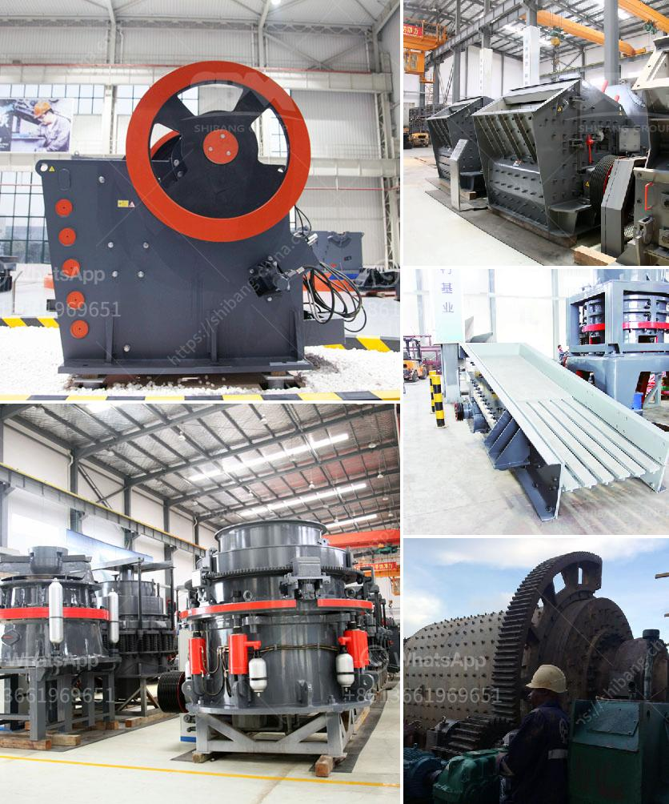

<h3>mineria de basalto o extraccion de basalto</h3>
La minería de basalto, también conocida como extracción de basalto, es una actividad industrial que implica la extracción y procesamiento de este tipo de roca volcánica para su uso en diversos sectores. El basalto es una piedra dura y resistente, de origen volcánico, que se forma a partir de la solidificación rápida de la lava.

La minería de basalto se lleva a cabo en muchas partes del mundo, ya que este material es ampliamente utilizado en la construcción y la fabricación de productos. Por lo general, este proceso implica la perforación y voladura de la roca para extraer bloques grandes, que luego se transportan a las instalaciones de procesamiento.

Una vez en las instalaciones de procesamiento, el basalto se tritura y se tamiza para obtener diferentes tamaños de agregados. Estos agregados de basalto se utilizan en la construcción de carreteras, la fabricación de hormigón y asfalto, así como en la producción de materiales de construcción como bloques y adoquines.

El basalto también se utiliza en la fabricación de productos decorativos y de diseño, como encimeras de cocina, azulejos y revestimientos de pared. Su apariencia natural y su durabilidad lo convierten en una opción popular para aquellos que buscan una opción estética y resistente.

Además de su uso en la industria de la construcción y la fabricación de productos, el basalto también tiene propiedades especiales que lo hacen atractivo en otros sectores. Por ejemplo, su capacidad de resistir altas temperaturas lo hace ideal para su uso en la fabricación de ladrillos refractarios, utilizados en hornos y otros procesos industriales de alta temperatura.

La extracción de basalto puede tener impactos ambientales significativos, ya que implica la remoción de grandes áreas de tierra. Sin embargo, hay medidas que pueden tomarse para minimizar estos impactos. Por ejemplo, se pueden implementar técnicas de rehabilitación de tierras para restaurar el paisaje después de la extracción. Además, es importante tener en cuenta las regulaciones y políticas ambientales locales para garantizar que la extracción se realice de manera sostenible y responsable.

Es crucial reconocer que, si bien la minería de basalto puede ser una actividad económica importante y beneficiosa en términos de infraestructura y desarrollo económico, también es esencial equilibrar estos aspectos con la conservación ambiental y la protección de los ecosistemas locales.

En conclusión, la minería de basalto, o extracción de basalto, es una actividad industrial que tiene un alcance amplio y una variedad de aplicaciones en la construcción y la fabricación de productos. Si se realiza de manera responsable y sostenible, puede proporcionar beneficios económicos y contribuir al desarrollo de diversas industrias. Sin embargo, es importante considerar los impactos ambientales y tomar medidas para mitigarlos y garantizar la protección del medio ambiente.
<h3>Contact us</h3><ul><li><strong>Whatsapp:&nbsp;<a href="https://wa.me/8613661969651">+8613661969651</a></strong></li><li><a href="https://swt.shibang-china.com/?git&amp;zhl&amp;mineria de basalto o extraccion de basalto"><strong>Online Service(chat now)</strong></a></li></ul><h3>Related</h3><ul><li><a href='magnetic separator conveyor indonesia.md'>magnetic separator conveyor indonesia</a></li><li><a href='gypsum crushing machine.md'>gypsum crushing machine</a></li><li><a href='stone crushing industry tanzania.md'>stone crushing industry tanzania</a></li><li><a href='stones crushing into building sand.md'>stones crushing into building sand</a></li><li><a href='ball mills in coimbatore.md'>ball mills in coimbatore</a></li></ul>