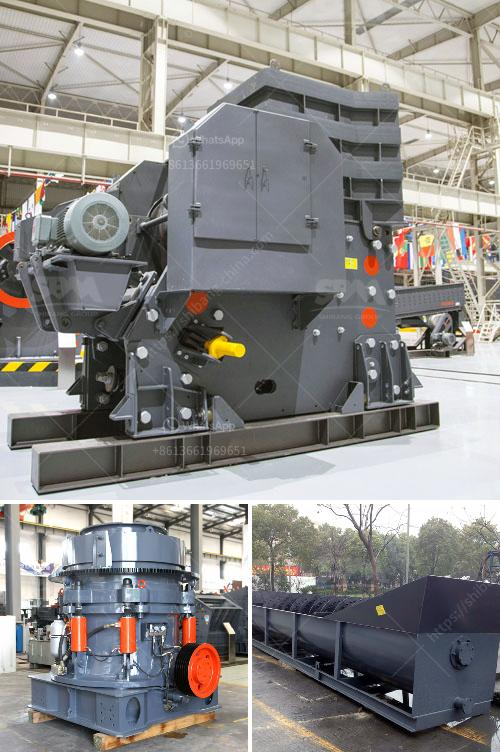

<h3>mines de cobalt de cuivre de la zambie</h3>
Located in the heart of Southern Africa, Zambia is widely known for its abundant mineral wealth. Among its most prized resources are copper and cobalt, which have played a crucial role in the country's economy for decades. This article sheds light on the mines de cobalt de cuivre de la Zambie (copper-cobalt mines of Zambia), exploring their significance, challenges, and environmental impact.

Since the 1920s, copper mining has been the lifeblood of Zambia's economy, earning it the title of "Copperbelt." The country possesses the second-largest copper reserves in Africa, rendering it a frontrunner in global copper production. Alongside copper, Zambia is also a significant producer of cobalt, often extracted as a by-product of copper mining.

Cobalt, a silvery-blue metal, is an essential component in the manufacturing of rechargeable batteries, making it crucial for the booming electric vehicle (EV) industry. With the worldwide shift towards clean and sustainable transportation solutions, demand for cobalt has soared, elevating its value and strategic importance. This surge in demand has provided an economic impetus for Zambia, making its cobalt resources a valuable asset.

The mining industry in Zambia, like many others globally, faces several challenges. One of the primary concerns is the environmental impact caused by mining activities. Mining operations can result in soil erosion, water pollution, and the destruction of natural habitats, affecting local wildlife. Efforts to mitigate these challenges have been made, but more comprehensive actions are needed to minimize the impact on the environment and surrounding communities.

The mining sector has historically contributed significantly to Zambia's revenue generation and job creation. Mining enterprises provide direct and indirect employment opportunities to thousands of Zambians, boosting the socio-economic development of the country. However, challenges such as income inequality and limited infrastructural development in mining areas persist. The government must continue to work towards ensuring a fair distribution of the sector's economic benefits among its citizens.

Recognizing the imperative of sustainable mining practices, Zambia has taken steps towards promoting responsible mining operations. The government has introduced legislation to enforce environmental regulations and social responsibility frameworks for mining companies. Additionally, efforts are being made to improve transparency, enhance revenue management, and ensure sustainable development in mining communities.

The Zambian copper-cobalt mines have played a paramount role in the country's economy, enabling it to become a key global player in copper and cobalt production. However, challenges related to environmental impact, social development, and sustainability need to be addressed. By embracing responsible mining practices, Zambia's mining sector can thrive while minimizing negative repercussions. Striking a balance between economic advancement, environmental preservation, and social development will ensure the continued prosperity of the copper-cobalt mines and contribute to Zambia's sustainable growth.
<h3>Contact us</h3><ul><li><strong>Whatsapp:&nbsp;<a href="https://wa.me/8613661969651">+8613661969651</a></strong></li><li><a href="https://swt.shibang-china.com/?git&amp;zhl&amp;mines de cobalt de cuivre de la zambie"><strong>Online Service(chat now)</strong></a></li></ul><h3>Related</h3><ul><li><a href='grinding equipments grinding equipments.md'>grinding equipments grinding equipments</a></li><li><a href='listing price tons per hour screw conveyor.md'>listing price tons per hour screw conveyor</a></li><li><a href='dolomite powder machine.md'>dolomite powder machine</a></li><li><a href='stone crushing plant germany.md'>stone crushing plant germany</a></li><li><a href='graphite processing flowsheet.md'>graphite processing flowsheet</a></li></ul>