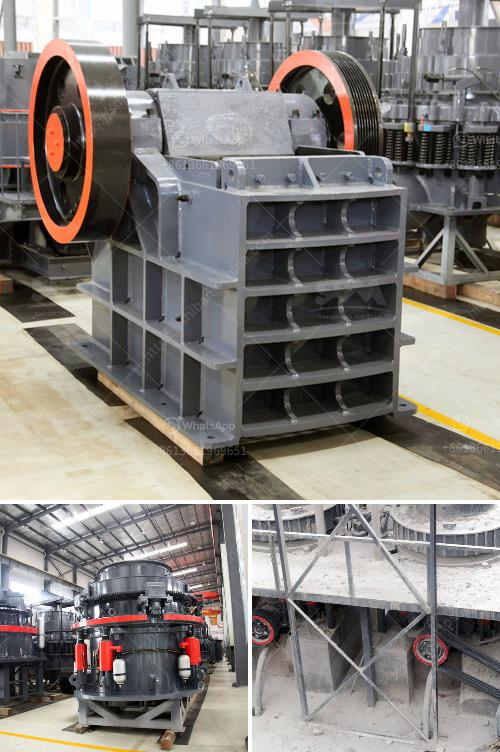

<h3>mini concrete crusher portable for rent</h3>
Concrete crushers are a convenient and affordable option for the disposal of concrete debris and demolition waste. Mini concrete crusher portable for rent, is a compact, single toggle jaw crusher with the capacity to crush up to 80 tons per hour.

Despite its small footprint, it still provides excellent productivity due to its jaw size of 600 x 400mm. It is the perfect solution for areas that do not permit any large-scale demolition or excavation projects. It is highly suitable for urban areas and confined spaces.

The mini concrete crusher is supplied with a full tank of diesel and should be refueled after approximately ten hours of usage. Alternatively, it can be powered by an external power supply once the crusher has been adjusted and setup for operation.

Mini crushers are ideal for smaller demolition jobs due to their compact size. They can be used in tight spaces, such as on construction sites, in buildings, or underneath concrete slabs. Portable crushers allow operators to reach even the most difficult areas easily.

Renting a mini crusher is a cost-effective alternative to purchasing a new crusher for demolition waste disposal. The rental rates for a mini crusher are relatively low and many companies provide delivery, onsite setup, and pickup for their customers. In addition, renting a crusher eliminates the need for costly transport and disposal fees.

The mini concrete crusher can be used for both concrete recycling and general waste removal application. Additionally, it can be loaded into a truck or trailer, making it highly portable and versatile.

Various attachments are available for the mini crusher, such as long and short jaws, hydraulic brush cutters, and screening buckets. These attachments can enhance the crusher's capabilities and allow for more efficient processing of different materials.

Mini crushers are designed to pulverize materials, such as concrete, bricks, asphalt, and other construction and demolition debris. They are also capable of processing reinforced concrete, allowing them to tackle even the toughest jobs.

The portable nature of the mini crusher allows for quick setup and dismantling, reducing the time required for transportation and assembly on site. This makes it highly efficient for projects that require fast turnaround times.

Not only is renting a mini crusher cost-effective, but it is also environmentally friendly. By recycling concrete debris on site, the need for additional landfill space is minimized. Additionally, the crushed concrete can be reused as an aggregate for new concrete production, reducing the demand for natural resources.

In summary, a mini concrete crusher portable for rent is a cost-effective solution for concrete debris disposal. It is highly versatile, efficient, and environmentally friendly. Whether for small-scale demolition projects or general waste removal, renting a mini crusher can save time, money, and resources.
<h3>Contact us</h3><ul><li><strong>Whatsapp:&nbsp;<a href="https://wa.me/8613661969651">+8613661969651</a></strong></li><li><a href="https://swt.shibang-china.com/?git&amp;zhl&amp;mini concrete crusher portable for rent"><strong>Online Service(chat now)</strong></a></li></ul><h3>Related</h3><ul><li><a href='high capacity ball mill malaysia.md'>high capacity ball mill malaysia</a></li><li><a href='china mineral ore processing mill ball.md'>china mineral ore processing mill ball</a></li><li><a href='stone crusher plant design pdf.md'>stone crusher plant design pdf</a></li><li><a href='malaysia sand washer supplier.md'>malaysia sand washer supplier</a></li><li><a href='1000 ton crusher.md'>1000 ton crusher</a></li></ul>