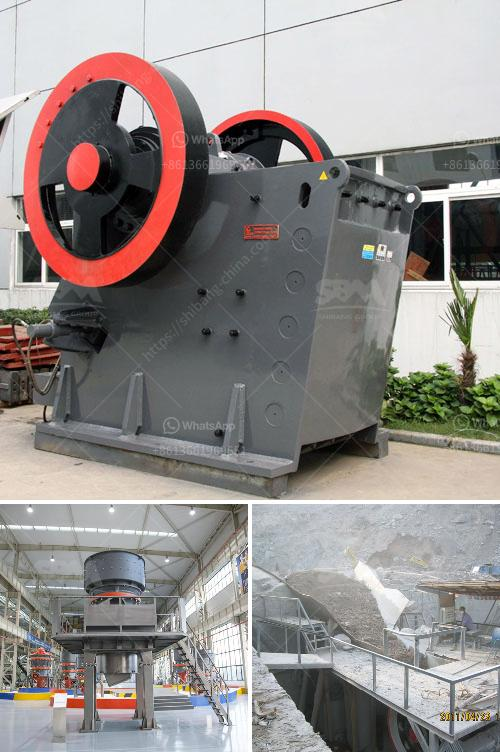

<h3>mini crusher hire johannesburg</h3>
In the bustling city of Johannesburg, construction projects are constantly taking place, from renovations to small-scale developments. These projects require powerful tools and equipment to ensure efficiency and speed. However, not everyone has access to such machinery, especially individuals and small businesses. This is where mini crusher hire Johannesburg comes into the picture, offering a convenient solution to all construction needs.

Mini crusher hire involves renting small-scale crushers that can easily be transported to construction sites. These crushers are perfect for various applications, including demolishing old buildings, crushing concrete waste, and recycling materials. They come equipped with powerful jaws that exert immense force, allowing them to break down and crush even the toughest materials.

1. Cost-effective: When planning a construction project, budgeting is crucial. Large-scale crushers can be expensive to purchase outright and may not be necessary for smaller projects. Mini crusher hire offers a cost-effective alternative, as individuals and businesses can rent equipment for the specific duration of their project at a fraction of the cost.

2. Versatility: Mini crushers are versatile machines that can be used on various sites and for various applications. From small-scale home renovations to larger construction projects, these crushers can handle a wide range of materials, including concrete, bricks, stones, and more. This versatility ensures that you have the right tool for any demolition or construction task at hand.

3. Compact and portable: One of the main advantages of mini crushers is their compact size. They can easily fit through narrow spaces and tight corners, making them ideal for urban construction projects in Johannesburg. Additionally, their portability allows for convenient transportation between different sites, minimizing downtime and maximizing productivity.

4. Environmentally friendly: Recycling and reusing materials are essential in promoting sustainable construction practices. Mini crushers contribute to this effort by effectively crushing and recycling materials on-site, reducing the need for transportation to recycling centers. This not only saves time and energy but also reduces carbon emissions and environmental impact.

5. Operator training and support: When renting mini crushers, reputable hire companies in Johannesburg provide operator training and support. This ensures that individuals are equipped with the knowledge and skills necessary to operate the equipment safely and efficiently. Additionally, expert assistance is typically available to provide technical support and address any concerns during the rental period.

Mini crusher hire Johannesburg offers a convenient and cost-effective solution for the construction industry. Whether you are a homeowner looking to renovate or a small business embarking on a construction project, these compact and portable crushers provide the power and versatility needed to tackle various applications. Not only do they save you money, but they also contribute to sustainable construction practices by recycling materials on-site. So, the next time you have a construction project in Johannesburg, consider mini crusher hire as your go-to solution for all your crushing and recycling needs.
<h3>Contact us</h3><ul><li><strong>Whatsapp:&nbsp;<a href="https://wa.me/8613661969651">+8613661969651</a></strong></li><li><a href="https://swt.shibang-china.com/?git&amp;zhl&amp;mini crusher hire johannesburg"><strong>Online Service(chat now)</strong></a></li></ul><h3>Related</h3><ul><li><a href='coal crusher machine capacity of 5 tons an hour.md'>coal crusher machine capacity of 5 tons an hour</a></li><li><a href='gold washing machine.md'>gold washing machine</a></li><li><a href='ballast making machine kenya.md'>ballast making machine kenya</a></li><li><a href='pioneer ve rock crusher.md'>pioneer ve rock crusher</a></li><li><a href='iron ore concentrate plant tpa production.md'>iron ore concentrate plant tpa production</a></li></ul>