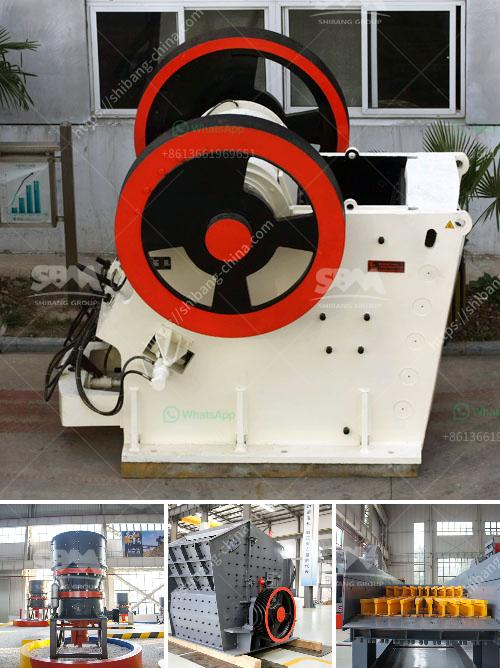

<h3>mini mining crusher dealers</h3>
The mining industry plays a crucial role in the economic development of countries around the world. This sector involves the extraction of valuable minerals and resources from the earth, which are essential for various industrial applications. Mining operations require robust machinery and equipment that can handle the rigorous demands of the job. When it comes to crushing rocks and ores to obtain required sizes, mini mining crushers prove to be indispensable assets. These compact crushers are highly efficient and reliable, and their availability through reputable dealers enhances their value.

Mini mining crushers are designed to break down materials into smaller particles for further processing. They are commonly used in construction, mining, and recycling applications, providing an efficient and cost-effective solution for reducing the size of materials. These crushers are specifically engineered for small to medium-scale operations and are suitable for various types of materials, including limestone, granite, iron ore, and even concrete.

One of the key advantages of mini mining crushers is their compact size. Unlike their larger counterparts, these crushers can fit into tight spaces, making them ideal for small mining operations or construction sites with limited room for machinery. Their compact design also allows for easy transportation, facilitating mobility between different worksites without much hassle. Whether you need to crush materials at the quarry or on multiple job sites, mini mining crushers offer flexibility and convenience.

Another significant benefit of mini mining crushers is their efficiency. Despite their size, these crushers deliver powerful performance, efficiently breaking down even the toughest materials. Their powerful motors and advanced crushing mechanisms ensure that the desired output size is achieved with minimum effort. Additionally, these crushers are equipped with features like adjustable jaw openings and hydraulic systems that allow for precise control and customization of the crushed materials' size.

Mini mining crusher dealers serve as reliable partners for mining companies and contractors in the industry. These dealers ensure that customers have access to high-quality and reliable mini crushers that meet their specific needs. Reputable dealers not only offer a wide range of options but also provide essential support services. Experienced dealers understand the unique requirements of the mining industry and can recommend the most suitable crushers according to the project's specifications. They also offer maintenance and repair services to ensure that the crushers continue to operate efficiently and minimize downtime.

It is crucial to choose reputable dealers when purchasing mini mining crushers. Verified dealers provide genuine products that meet industry standards, guaranteeing the reliability and performance of the crushers. They also provide warranties, assuring customers of post-purchase support in case of any issues. By partnering with reliable dealers, mining companies can focus on their core operations while knowing that their crushing needs are well taken care of.

In conclusion, mini mining crushers are invaluable assets in the mining industry, providing efficient and reliable solutions for crushing various materials. These compact crushers offer mobility, efficiency, and versatility, making them suitable for small to medium-scale mining operations. With reputable dealers, mining companies can access these crushers with confidence, knowing that they are receiving high-quality products and reliable support. Investing in mini mining crushers and partnering with dealers prove to be intelligent choices for those seeking enhanced productivity and cost-effectiveness in their mining operations.
<h3>Contact us</h3><ul><li><strong>Whatsapp:&nbsp;<a href="https://wa.me/8613661969651">+8613661969651</a></strong></li><li><a href="https://swt.shibang-china.com/?git&amp;zhl&amp;mini mining crusher dealers"><strong>Online Service(chat now)</strong></a></li></ul><h3>Related</h3><ul><li><a href='kaolin raymond mill price.md'>kaolin raymond mill price</a></li><li><a href='jaw crushers from saudi.md'>jaw crushers from saudi</a></li><li><a href='quarrying crusher machines.md'>quarrying crusher machines</a></li><li><a href='sri lankan building sand price.md'>sri lankan building sand price</a></li><li><a href='process flow of bajri washing plant.md'>process flow of bajri washing plant</a></li></ul>