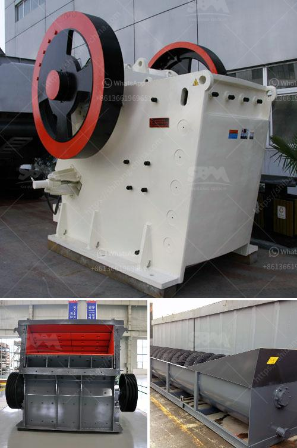

<h3>mini robo sand unit price in india</h3>
The construction industry in India is evolving rapidly, with the introduction of new technologies and innovative building materials. One such material that has gained popularity in recent years is robo sand, a manufactured sand that is used as a substitute for river sand in construction projects. Robo sand is known for its high quality and strength, making it an ideal choice for various construction applications.

Mini robo sand units have become a preferred choice for small-scale construction projects in India. These units are equipped with a compact and portable robo sand making machine, making it easier to move from one project site to another. The mini robo sand unit reduces the dependency on traditional methods of sand extraction, which are often harmful to the environment.

The price of a mini robo sand unit in India varies depending on factors such as the capacity of the unit, the size of the machine, and the location of the manufacturer. On average, the price of a mini robo sand unit in India ranges from INR 50,000 to INR 1,00,000. However, it is important to note that these prices are indicative and may vary based on market conditions and other factors.

One of the major advantages of using a mini robo sand unit is its cost-effectiveness. Traditional methods of sand extraction can be expensive and time-consuming. In addition, the availability of river sand is diminishing, leading to an increase in its price. On the other hand, mini robo sand units can produce high-quality sand at a fraction of the cost, making it a cost-effective alternative for small-scale construction projects.

Moreover, mini robo sand units offer several other benefits. The use of robo sand reduces the dependence on river sand, which is becoming scarce due to excessive mining and environmental concerns. By using robo sand, construction projects can contribute to environmental sustainability. Additionally, robo sand is of consistent quality, ensuring a uniform mix and reducing the chances of quality-related issues in construction.

In terms of efficiency, mini robo sand units are designed to produce sand in a controlled and efficient manner. The process of manufacturing robo sand involves crushing granite rocks into sand-sized particles. This crushed sand is then washed and graded to remove impurities, resulting in a high-quality product that meets the required specifications.

Mini robo sand units are gaining popularity not only due to their cost-effectiveness and efficiency but also because they offer a sustainable and eco-friendly solution to the construction industry. With the increasing focus on sustainable construction practices, the demand for robo sand is expected to rise in the coming years.

In conclusion, mini robo sand units in India are becoming increasingly popular for their cost-effectiveness, efficiency, and environmental sustainability. With the ability to produce high-quality sand at a fraction of the cost, mini robo sand units provide a viable alternative to traditional sand extraction methods. As the construction industry continues to evolve, it is expected that the demand for mini robo sand units will continue to rise, making them an essential component of construction projects in India.
<h3>Contact us</h3><ul><li><strong>Whatsapp:&nbsp;<a href="https://wa.me/8613661969651">+8613661969651</a></strong></li><li><a href="https://swt.shibang-china.com/?git&amp;zhl&amp;mini robo sand unit price in india"><strong>Online Service(chat now)</strong></a></li></ul><h3>Related</h3><ul><li><a href='rock sand plant feasibility report.md'>rock sand plant feasibility report</a></li><li><a href='second hand quarry crusher machinery price in india.md'>second hand quarry crusher machinery price in india</a></li><li><a href='jual jaw crusher second hand.md'>jual jaw crusher second hand</a></li><li><a href='prices for stone crushing machine zimbabwe.md'>prices for stone crushing machine zimbabwe</a></li><li><a href='granite stones crusher.md'>granite stones crusher</a></li></ul>