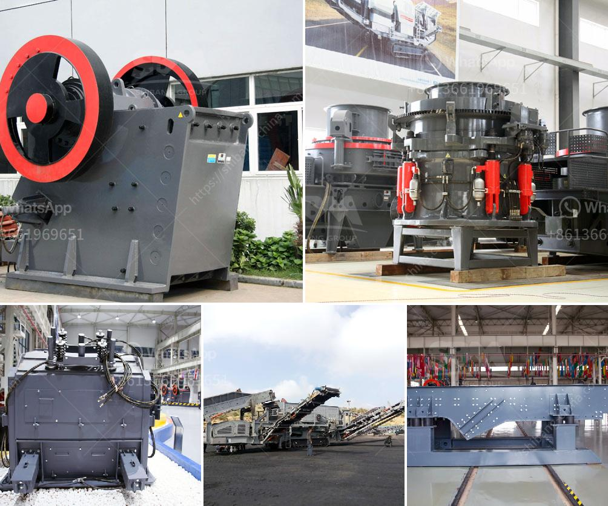

<h3>mining calcium carbonate vietnam</h3>
Vietnam, renowned for its breathtaking landscapes and rich natural resources, is increasingly making its mark in the mining industry. One particular resource that has been gaining traction in recent years is calcium carbonate. Located beneath Vietnam's lush surface lies extensive deposits of this versatile mineral, which is used in a wide range of industries including construction, paper, pharmaceuticals, and agriculture.

Calcium carbonate mining in Vietnam has experienced a significant surge due to the growing demand for this substance worldwide. The country's calcium carbonate mines are concentrated in the northern provinces of Yen Bai and Bac Kan, where the reserves are estimated to be in the billions of tons. These reserves not only provide domestic supply but also satisfy the needs of international markets.

The process of calcium carbonate extraction begins with identifying viable deposits. Afterward, the ore is extracted from the earth using heavy machinery, such as excavators and bulldozers. Once extracted, it undergoes processes like crushing and milling to achieve the desired particle size. Subsequently, the mineral is treated with chemicals to enhance its quality and then sorted for packaging and delivery.

Vietnam's mining sector is regulated by the government to ensure environmental sustainability and responsible practices. In recent years, there has been a focus on reducing the environmental impact of mining operations. Mining companies are required to implement measures to minimize soil erosion, water pollution, and to rehabilitate the mined areas to their original state where feasible.

The extraction of calcium carbonate offers numerous benefits for Vietnam's economy. The industry creates employment opportunities, particularly in rural areas where job availability may be limited. Additionally, the export of calcium carbonate contributes to Vietnam's foreign exchange earnings, boosting the overall economic growth of the country.

However, it is crucial to strike a balance between economic benefits and environmental preservation. Mining operations must adhere to strict regulations to minimize their impact on the environment and local communities. Sustainable practices and technologies should be employed to mitigate any negative consequences associated with calcium carbonate extraction.

Mining calcium carbonate in Vietnam is a promising endeavor that has the potential to further contribute to the country's growth. With proper regulations and sustainable practices, this natural resource can continue to be mined responsibly, ensuring a prosperous future for both the industry and the environment.
<h3>Contact us</h3><ul><li><strong>Whatsapp:&nbsp;<a href="https://wa.me/8613661969651">+8613661969651</a></strong></li><li><a href="https://swt.shibang-china.com/?git&amp;zhl&amp;mining calcium carbonate vietnam"><strong>Online Service(chat now)</strong></a></li></ul><h3>Related</h3><ul><li><a href='small scale mining plant philippines diagram.md'>small scale mining plant philippines diagram</a></li><li><a href='prices of cement clinker grinding unit in india.md'>prices of cement clinker grinding unit in india</a></li><li><a href='plamnta mobile stone crusher.md'>plamnta mobile stone crusher</a></li><li><a href='clinker grinding mill germany price.md'>clinker grinding mill germany price</a></li><li><a href='clay crusher manufacturing process.md'>clay crusher manufacturing process</a></li></ul>