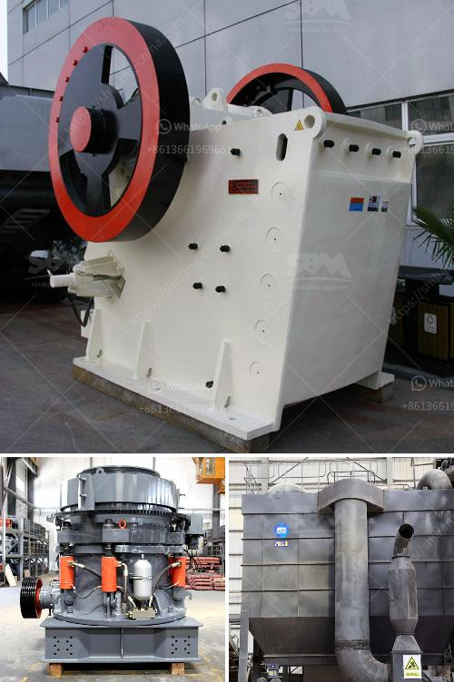

<h3>mining equipment and hire zimbabwe</h3>
Zimbabwe is a mineral-rich country blessed with abundant resources such as gold, diamonds, platinum, coal, and copper, among others. However, the mining sector requires substantial investment to fully optimize its potential. Effective and efficient mining operations heavily rely on modern and well-maintained equipment. To bridge this gap, a growing trend in Zimbabwe is the availability of mining equipment for hire, offering mining companies a cost-effective and practical solution.

Mining equipment plays a pivotal role in the extraction and processing of minerals. Traditional methods of mining are becoming obsolete due to their inefficiency and high operational costs. Modern mining equipment, with its advanced technology and equipment, not only enhances productivity but also promotes safer working conditions. By embracing state-of-the-art machinery, Zimbabwe's mining sector can achieve higher production levels, substantial cost savings, and improved profitability.

1. Cost-Effective Solution: One of the major advantages of hiring mining equipment in Zimbabwe is its cost-effectiveness. Purchasing equipment outright can be a significant financial burden, causing strains on capital reserves. By opting for equipment hire, mining companies can allocate their resources more efficiently, diverting funds to other important aspects of the operation.

2. Access to the Latest Technology: The mining industry is evolving rapidly, with innovations continually improving performance and productivity. However, acquiring cutting-edge mining equipment is an expensive endeavor. Hiring equipment allows mining companies to access the latest technology and equipment without the upfront costs, ensuring they remain competitive in the market.

3. Flexibility and Customization: Every mining operation is unique, with specific requirements and challenges. Hiring mining equipment provides the flexibility to choose equipment tailored to specific mining needs. Whether it's excavators, bulldozers, dump trucks, or drilling rigs, mining companies can select the right combination suitable for the size and type of operation, optimizing performance and productivity.

4. Reduced Maintenance Costs: Mining equipment requires frequent maintenance, which can be a costly affair. Equipment hire offers the advantage of having the necessary maintenance and repairs undertaken by the equipment provider. This significantly minimizes downtime, ensuring continuous operations and maximizing productivity.

With the increasing demand for mining equipment hire in Zimbabwe, several reputable companies have emerged, providing tailored solutions for mining activities. These companies offer a wide range of equipment, including earthmoving machinery, drilling rigs, crushing and screening equipment, and transportation solutions.

Additionally, equipment hire companies focus on delivering reliable and well-maintained equipment. They provide skilled operators and comprehensive training, ensuring safe and efficient usage. By employing trained operators, mining companies can enhance their operational output while minimizing the risk of accidents.

The availability of mining equipment for hire in Zimbabwe has opened up opportunities for mining companies to operate more efficiently and cost-effectively. By opting for equipment hire, mining companies can access the latest technology, reduce operational costs, and increase productivity. Moreover, equipment hire services are complemented by comprehensive maintenance and support, offering a holistic solution to the mining industry's needs. To ensure a sustainable and thriving mining sector in Zimbabwe, the government and mining companies should embrace the benefits of equipment hire, fostering growth and prosperity for the nation.
<h3>Contact us</h3><ul><li><strong>Whatsapp:&nbsp;<a href="https://wa.me/8613661969651">+8613661969651</a></strong></li><li><a href="https://swt.shibang-china.com/?git&amp;zhl&amp;mining equipment and hire zimbabwe"><strong>Online Service(chat now)</strong></a></li></ul><h3>Related</h3><ul><li><a href='coal washing processing plant india manufacturer.md'>coal washing processing plant india manufacturer</a></li><li><a href='used stone crusher machines.md'>used stone crusher machines</a></li><li><a href='talcum powder machine.md'>talcum powder machine</a></li><li><a href='cost of a mill of hammers.md'>cost of a mill of hammers</a></li><li><a href='iron ore cruseher plant.md'>iron ore cruseher plant</a></li></ul>