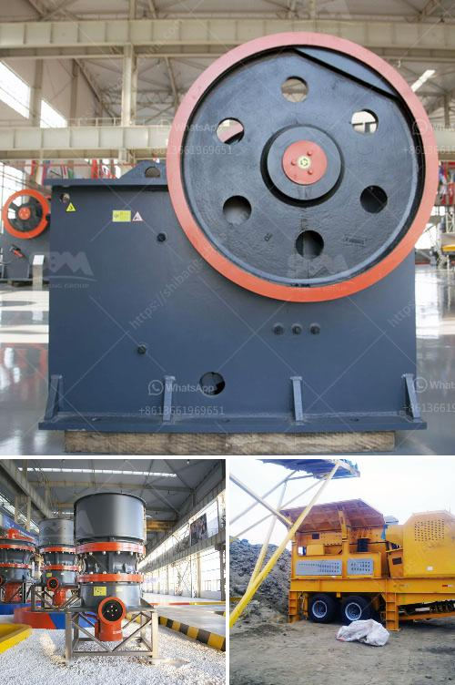

<h3>mining equipment chrome concentrate in turkey</h3>
Mining has always been an essential industry in Turkey, contributing greatly to the country's economy and development. One of the significant mining activities in Turkey is the extraction and production of chrome concentrate. Chrome concentrate is a crucial material used in various industries, such as stainless steel production, refractory bricks, and chemical applications.

Turkey is known for its vast reserves of chrome ore, making it a significant player in the global chrome market. The country has a rich history of chrome mining, and over the years, it has emerged as one of the leading chrome ore producers worldwide. The availability of high-quality chrome ore deposits and advanced mining techniques has propelled Turkey's chrome concentrate production.

The process of extracting chrome concentrate in Turkey involves several stages. It begins with the exploration and discovery of chrome ore deposits. Geologists and mining experts use advanced techniques such as aerial surveys and geophysical studies to identify potential chrome ore sites. Once a viable deposit is found, the mining company obtains the necessary permits and starts developing the mine.

In the mining process, heavy machinery and equipment are used to excavate the chrome ore from the earth. Bulldozers, excavators, and trucks play a crucial role in transporting the ore to the processing plant. These mining equipment have significantly improved over the years, allowing for more efficient and environmentally friendly extraction methods.

At the processing plant, the chrome ore undergoes beneficiation to enhance its quality and remove impurities. Various techniques, such as crushing, grinding, and gravity separation, are employed to separate the ore into different particle sizes and concentrate the desired chrome content. The resulting chrome concentrate is then further processed and prepared for shipment to customers.

Turkey's chrome concentrate production is primarily driven by large mining companies and multinational corporations that have invested heavily in the industry. They have the necessary resources, expertise, and technology to extract chrome ore efficiently and produce high-quality chrome concentrate. These companies play a vital role in meeting the global demand for chrome concentrate, especially from steel and chemical industries.

The chrome concentrate produced in Turkey is shipped to various countries around the world. As a major exporter, Turkey has established trade partnerships with many countries, including China, the United States, and European nations. The chrome concentrate from Turkey is renowned for its excellent quality, consistency, and competitive pricing, making it a highly sought-after commodity in the international market.

In conclusion, mining equipment chrome concentrate production in Turkey is a significant industry that contributes to the country's economy and serves various global markets. The availability of abundant chrome ore deposits and advanced mining techniques has positioned Turkey among the top chrome concentrate producers worldwide. The industry's commitment to efficient extraction methods and high-quality production has cemented Turkey's role as a reliable supplier of chrome concentrate to industries worldwide.
<h3>Contact us</h3><ul><li><strong>Whatsapp:&nbsp;<a href="https://wa.me/8613661969651">+8613661969651</a></strong></li><li><a href="https://swt.shibang-china.com/?git&amp;zhl&amp;mining equipment chrome concentrate in turkey"><strong>Online Service(chat now)</strong></a></li></ul><h3>Related</h3><ul><li><a href='vibratory feeder manufacturer china.md'>vibratory feeder manufacturer china</a></li><li><a href='feasibility study quartz stone.md'>feasibility study quartz stone</a></li><li><a href='list gold mining equipment and machines.md'>list gold mining equipment and machines</a></li><li><a href='crusher equipment oman in muscat oman.md'>crusher equipment oman in muscat oman</a></li><li><a href='gold processing ball mills in india china.md'>gold processing ball mills in india china</a></li></ul>