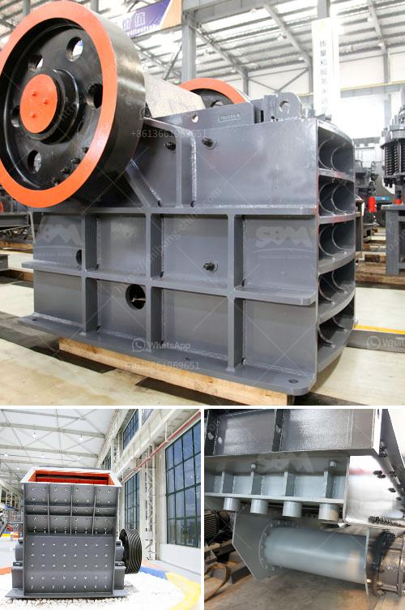

<h3>mining equipment for sale in japan</h3>
Japan, known for its technological prowess and innovation, offers a wide range of mining equipment for sale. With its advanced technology, well-established infrastructure, and high-quality products, Japan is an ideal destination for miners seeking top-of-the-line mining equipment.

One of the primary mining equipment categories in Japan is excavators. These powerful machines are used to extract minerals and other valuable resources from the earth. Japanese excavators are renowned for their durability, efficiency, and cutting-edge features. With various models and sizes available, miners can choose the perfect excavator to suit their specific mining needs.

In addition to excavators, Japan also offers a comprehensive selection of crushers, loaders, and drills. Crushers are essential for breaking down large rocks and minerals into smaller, manageable pieces. Japanese crushers are known for their reliability, precision, and high-performance capabilities. Loaders, on the other hand, are used to transport materials within the mining site. Japanese loaders are designed to withstand heavy loads and adverse working conditions, ensuring optimal productivity. Lastly, drills are vital in creating boreholes and initiating the mining process. Japanese drill machines are renowned for their accuracy, speed, and endurance - characteristics that are crucial for any mining operation.

When considering mining equipment for sale in Japan, it is essential to mention the country's commitment to safety. Japan has strict regulations in place to ensure mining operations adhere to the highest safety standards. This commitment to safety extends to the design and manufacturing of mining equipment. Japanese mining equipment manufacturers prioritize safety features, such as stability, operator visibility, and emergency shut-off systems, to minimize accidents and protect miners.

To discover the best deals on mining equipment for sale in Japan, potential buyers can explore online platforms and contact local distributors or manufacturers. These platforms provide access to a wide range of mining equipment options with detailed specifications and pricing information. Additionally, potential buyers can attend mining industry trade shows and exhibitions in Japan to personally assess the quality and performance of different mining equipment models.

In conclusion, Japan is a favorable destination for miners seeking high-quality and technologically advanced mining equipment. With a wide range of excavators, crushers, loaders, and drills available, miners can find the perfect equipment to enhance their mining operations. Furthermore, Japan's strict safety regulations ensure that the equipment purchased meets the highest safety standards. Whether you are a seasoned miner or entering the industry for the first time, the mining equipment for sale in Japan offers unparalleled quality, performance, and value.
<h3>Contact us</h3><ul><li><strong>Whatsapp:&nbsp;<a href="https://wa.me/8613661969651">+8613661969651</a></strong></li><li><a href="https://swt.shibang-china.com/?git&amp;zhl&amp;mining equipment for sale in japan"><strong>Online Service(chat now)</strong></a></li></ul><h3>Related</h3><ul><li><a href='calcium carbonate milling plant in turkey.md'>calcium carbonate milling plant in turkey</a></li><li><a href='ethiopia rock crusher.md'>ethiopia rock crusher</a></li><li><a href='used jaw crusher machine for sale nepal.md'>used jaw crusher machine for sale nepal</a></li><li><a href='copper ore crushing plant in chile.md'>copper ore crushing plant in chile</a></li><li><a href='south africa gold processing equipment.md'>south africa gold processing equipment</a></li></ul>