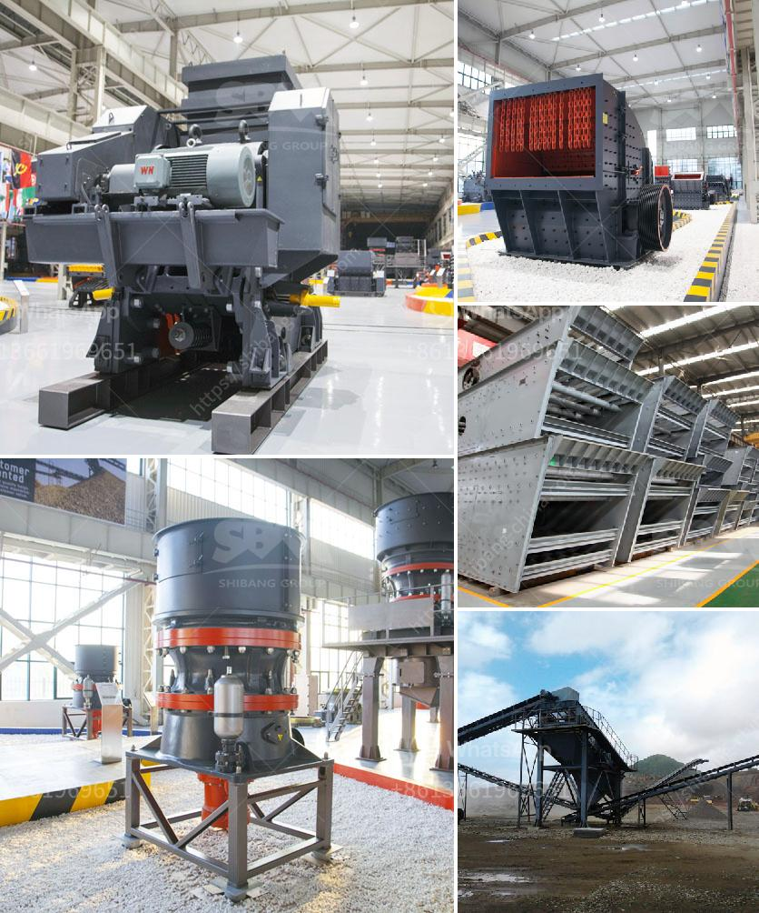

<h3>mining equipment for sale west africa</h3>
West Africa is renowned for its rich mineral resources, making it an attractive destination for mining companies and investors. With abundant natural deposits of gold, iron ore, bauxite, and other minerals, the region offers excellent mining opportunities. To tap into this potential, companies need to equip themselves with the right mining equipment. In this article, we will explore the various mining equipment available for sale in West Africa.

One of the essential mining equipment required for successful mining operations is a mining drill. It is imperative to choose the right type of drilling equipment that suits your mining requirements. Many factors, such as the type of mineral being mined, the depth of the mine, and the terrain, influence the selection of the mining drill. Portable drills, rotary drills, and top hammer drills are some of the commonly used types of mining drills available in West Africa.

Excavators are another crucial mining equipment commonly used in West Africa. Excavators are versatile machines ideal for various mining tasks, such as digging trenches, removing overburden, and extracting minerals. In the mining industry, hydraulic excavators are preferred due to their power, agility, and high digging capacity. Companies can choose from a range of excavators suitable for different mining conditions and production requirements.

For surface mining operations, large trucks and loaders are indispensable mining equipment. Haul trucks are used to transport minerals or overburden from the mine site to the processing plant or stockpile. These trucks are designed to handle heavy loads over long distances in challenging terrains. Articulated trucks and rigid trucks are commonly used in West Africa for surface mining.

Loaders, on the other hand, are essential for loading mined materials onto trucks or into processing plants. Wheel loaders and track loaders are commonly used in West Africa mining operations due to their mobility, ease of operation, and high versatility. Loaders can handle a wide range of materials, making them suitable for various mining applications, such as loading ore, coal, or aggregate.

In addition to drills, excavators, trucks, and loaders, there are several other types of mining equipment available in West Africa. These include dozers for clearing land and pushing materials, graders for creating level surfaces, and crushers for processing minerals. Furthermore, specialized equipment like underground mining machinery, conveyor systems, and rock breakers are also available for specific mining applications.

To access quality mining equipment for sale in West Africa, it is recommended to seek reputable suppliers. These suppliers offer a wide range of mining equipment manufactured by trusted brands known for their durability, reliability, and performance. Additionally, they provide after-sales services and technical support to ensure smooth mining operations.

As West Africa continues to attract mining investments, the demand for mining equipment is expected to rise. Investing in the right mining equipment is crucial for efficient and cost-effective mining operations. By choosing the suitable equipment, companies can enhance productivity, reduce downtime, and maximize the extraction of valuable minerals. With the right mining equipment, West Africa's mining industry can unlock its full potential and contribute to economic growth and development in the region.
<h3>Contact us</h3><ul><li><strong>Whatsapp:&nbsp;<a href="https://wa.me/8613661969651">+8613661969651</a></strong></li><li><a href="https://swt.shibang-china.com/?git&amp;zhl&amp;mining equipment for sale west africa"><strong>Online Service(chat now)</strong></a></li></ul><h3>Related</h3><ul><li><a href='vibratory screen south africa.md'>vibratory screen south africa</a></li><li><a href='hydro sizing silica sand crusher plant.md'>hydro sizing silica sand crusher plant</a></li><li><a href='sand wash plants for sale in texas.md'>sand wash plants for sale in texas</a></li><li><a href='latest stone crusher machine price india.md'>latest stone crusher machine price india</a></li><li><a href='pe jaw crusher.md'>pe jaw crusher</a></li></ul>