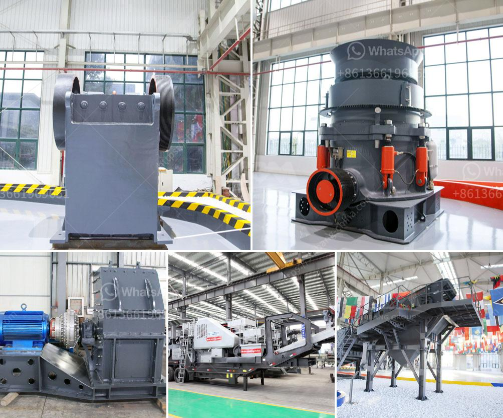

<h3>mining machinery companies in germany</h3>
Germany is a leading country in the field of mining machinery. With its rich history and expertise in engineering, German companies have consistently delivered top-quality equipment for the mining industry. These companies play a crucial role in ensuring the efficiency, safety, and productivity of mining operations worldwide.

One of the prominent mining machinery companies in Germany is Caterpillar. Known for its innovative solutions, Caterpillar offers a wide range of mining equipment, such as excavators, bulldozers, and trucks. Their equipment is designed to withstand harsh conditions and maximize productivity. Caterpillar's commitment to sustainability is also evident in their eco-friendly machines, which reduce fuel consumption and emissions.

Another notable company in Germany's mining machinery sector is Komatsu. With a global presence and a history dating back over 100 years, Komatsu has established itself as a reliable provider of high-quality mining equipment. Their products include hydraulic excavators, dump trucks, and dozers, all designed to meet the specific needs of the mining industry.

Liebherr is another prominent player in the German mining machinery market. This family-owned company has a long-standing tradition of technological innovation. Their mining machinery includes large-scale excavators, haul trucks, and drill rigs, which are used in open-pit mining operations worldwide. Liebherr's commitment to research and development ensures that their equipment remains at the forefront of industry standards.

Germany is also home to Wirtgen Group, a leading manufacturer of mining machinery for surface mining, road construction, and mineral processing. Wirtgen's mining equipment includes surface miners, road milling machines, and crushers, among others. Their cutting-edge technology enables efficient and precise operations, increasing productivity and reducing costs.

Overall, mining machinery companies in Germany are renowned for their engineering excellence, technological innovation, and commitment to sustainability. Their high-quality equipment ensures the smooth and efficient operation of mining projects worldwide. With Germany's renowned reputation in engineering and manufacturing, these companies continue to set global standards in the mining machinery industry.
<h3>Contact us</h3><ul><li><strong>Whatsapp:&nbsp;<a href="https://wa.me/8613661969651">+8613661969651</a></strong></li><li><a href="https://swt.shibang-china.com/?git&amp;zhl&amp;mining machinery companies in germany"><strong>Online Service(chat now)</strong></a></li></ul><h3>Related</h3><ul><li><a href='aggregate crushing plant price.md'>aggregate crushing plant price</a></li><li><a href='iron crushing equipment cost.md'>iron crushing equipment cost</a></li><li><a href='quarry crusher equipment made in turkey.md'>quarry crusher equipment made in turkey</a></li><li><a href='stone crusher machine malaysia.md'>stone crusher machine malaysia</a></li><li><a href='price hammer mill price mill pulverizer.md'>price hammer mill price mill pulverizer</a></li></ul>