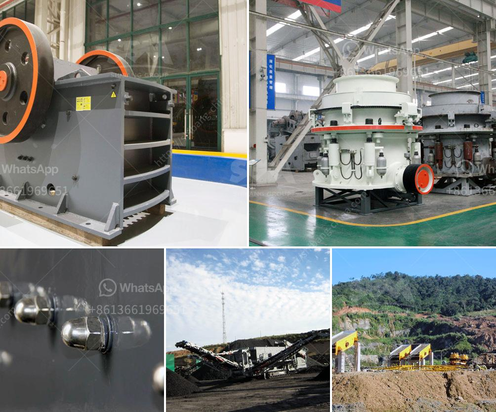

<h3>mobil rock pulverizer</h3>
In recent years, the demand for mobile rock pulverizers has skyrocketed as individuals and businesses alike are on the lookout for efficient and cost-effective methods to crush and pulverize rocks on-site. Whether it be for construction, mining, or landscaping purposes, mobile rock pulverizers have proven to be an invaluable tool in various industries.

A mobile rock pulverizer, also known as a mobile impact crusher, is a compact crusher that can be directly transported to the work site using a truck or trailer. It is equipped with a robust rotor with hammer-like blow bars that rotate at high speeds, effectively pulverizing rocks into smaller particles with ease.

One of the primary advantages of a mobile rock pulverizer is its versatility. It can be easily transported to different locations, allowing for on-site crushing and pulverizing. This eliminates the need to transport large quantities of rocks to a centralized facility, saving both time and money. Additionally, if multiple sites need pulverizing, a single mobile rock pulverizer can be used for all the locations, enhancing efficiency and productivity.

Another advantage of mobile rock pulverizers is their ability to handle various types of rocks. From limestone and granite to concrete and asphalt, these pulverizers can effectively crush and pulverize rocks of different hardness levels. This makes them suitable for a wide range of applications, including road construction, foundation work, and even recycling projects.

Furthermore, mobile rock pulverizers are highly efficient machines that deliver consistent results. The powerful rotor combined with the blow bars ensures a high crushing ratio, reducing rocks into fine particles in a single pass. This not only saves time but also minimizes energy consumption, making the pulverizer an environmentally friendly option.

One crucial aspect to consider when investing in a mobile rock pulverizer is its maintenance and serviceability. Fortunately, most manufacturers provide easy access to crucial components, allowing for quick maintenance and repairs when necessary. Additionally, these pulverizers are often equipped with advanced automation systems that monitor and optimize the machine's performance, ensuring maximum efficiency and longevity.

In conclusion, mobile rock pulverizers have revolutionized the way rocks are crushed and pulverized on-site. With their portability, versatility, and efficiency, they have proven to be an essential tool for various industries. From construction and mining to recycling projects, these pulverizers offer a cost-effective and powerful solution for on-site rock pulverizing needs.
<h3>Contact us</h3><ul><li><strong>Whatsapp:&nbsp;<a href="https://wa.me/8613661969651">+8613661969651</a></strong></li><li><a href="https://swt.shibang-china.com/?git&amp;zhl&amp;mobil rock pulverizer"><strong>Online Service(chat now)</strong></a></li></ul><h3>Related</h3><ul><li><a href='ball mill in mining.md'>ball mill in mining</a></li><li><a href='dorries vertical grinders used for sale europe.md'>dorries vertical grinders used for sale europe</a></li><li><a href='crusher conveyor belt.md'>crusher conveyor belt</a></li><li><a href='stone crusher saudi.md'>stone crusher saudi</a></li><li><a href='latest stone crusher machine price india.md'>latest stone crusher machine price india</a></li></ul>