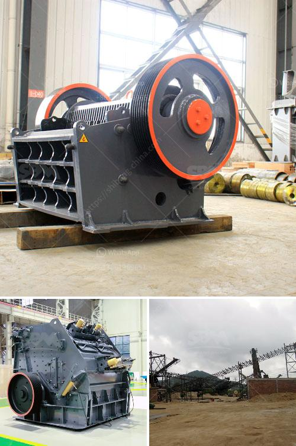

<h3>mobile coal washing plant</h3>
Mobile coal washing plant is an effective method to clean and process coal for sale or utilization. It offers a modular, flexible and portable solution for coal washing, which greatly increases efficiency and reduces costs. Coal washing involves using water, mechanical techniques, and gravity separation to separate impurities from coal, resulting in a cleaner and more valuable product.

The mobile coal washing plant is typically portable, consisting of a feed hopper with a belt feeder, vibrating screen, trommel drum scrubber, and water supply system. The feeding system ensures a steady flow of coal into the washing system, while the vibrating screen and trommel drum scrubber help to separate large debris and stones from the coal. The water supply system provides the necessary water for washing and helps to carry away the impurities.

One of the significant advantages of a mobile coal washing plant is its modular design, which allows for easy and quick installation. It can be transported to different sites, making it suitable for remote areas or coal mines with multiple operations. The modular design also makes it flexible, allowing the plant to be customized according to specific coal properties and desired coal quality.

In terms of efficiency, a mobile coal washing plant offers several benefits. Firstly, it reduces the transportation costs associated with transporting coal to a central washing facility. Instead, coal can be washed directly at the mine site, minimizing the distance and time required for transportation.

Secondly, mobile coal washing plants enable on-site processing, eliminating the need for additional handling and stockpiling of raw coal. This reduces coal loss, dust emissions, and environmental impact.

Moreover, the gravity separation and water-based techniques used in coal washing help to remove impurities such as sulfur, rock, and ash. This results in a cleaner coal product that has a higher calorific value and is more marketable. Clean coal is in high demand, as it is utilized in various industries, including power generation, steel production, and cement manufacturing.

The mobile coal washing plant is not only a cost-effective solution but also an environmentally friendly one. By reducing energy consumption and water usage, it contributes to the overall sustainability of coal mining operations. Additionally, the plant's compact design and efficient processes help to minimize the plant's footprint and impact on the environment.

In conclusion, a mobile coal washing plant is a versatile and efficient solution for coal washing. Its modular design, portability, and flexibility make it suitable for various coal mining operations. The plant's ability to separate impurities from coal results in a cleaner and more valuable product. Overall, the mobile coal washing plant offers numerous advantages, including cost reduction, environmental benefits, and improved coal quality.
<h3>Contact us</h3><ul><li><strong>Whatsapp:&nbsp;<a href="https://wa.me/8613661969651">+8613661969651</a></strong></li><li><a href="https://swt.shibang-china.com/?git&amp;zhl&amp;mobile coal washing plant"><strong>Online Service(chat now)</strong></a></li></ul><h3>Related</h3><ul><li><a href='portable screening and drying sand.md'>portable screening and drying sand</a></li><li><a href='listing price tons per hour screw conveyor.md'>listing price tons per hour screw conveyor</a></li><li><a href='mobile crusher in japan used crusher.md'>mobile crusher in japan used crusher</a></li><li><a href='mobile crushing equipment for sale.md'>mobile crushing equipment for sale</a></li><li><a href='suppliers kenya crusher.md'>suppliers kenya crusher</a></li></ul>