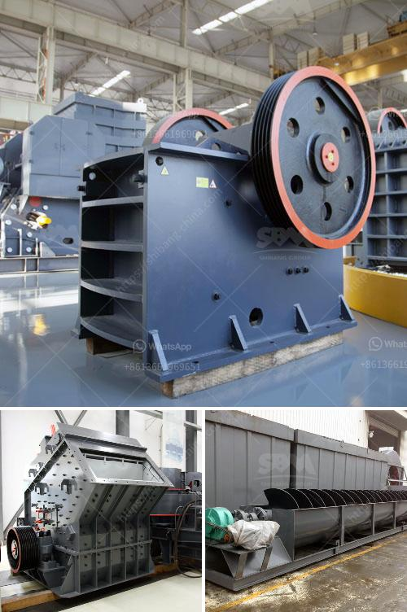

<h3>mobile cone crusher for sale</h3>
Mobile cone crusher is one of the most sought after portable plants in the current market due to its unparalleled advantages. Our company has been committed to the research and development of the crushing and screening equipment, focusing on providing customers with efficient, reliable, and economical equipment solutions. The mobile cone crusher for sale is the largest tracked cone crusher in the range and is suitable for secondary and tertiary crushing. This is versatile mobile cone crusher with excellent cubicity, throughput and reduction ratios.

The cone crusher for sale is a perfect match with the mobile crushers in the construction and demolition waste recycling industry. Thanks to its compact size and sturdy construction, it offers excellent productivity even in demanding conditions. With a unique combination of crusher cavity design, crushing forces, reliability, and advanced automation, our cone crusher provides high performance and low total cost.

A cone crusher is suitable for crushing a variety of mid-hard and above mid-hard materials. Feed is dropped to the crusher from the top and it is crushed between the crushing chamber and the slowly rotating cone. Cone crushers are mainly used for secondary and tertiary crushing, which can significantly increase the particle size of the final product. The hydraulic system, which is typically present in cone crushers, provides for hydraulic adjustment of the discharge setting, which allows for the transition between the crushing and discharging processes, reducing the downtime and overall operational costs.

The mobile cone crusher is widely used in mining, coal mining, and construction waste recycling, earthwork, urban infrastructure, roads or construction sites and site operations. It is a cost-effective device for crushing hard materials, such as cement clinker, limestone, gypsum, coal gangue, etc. Due to its simple structure, low cost, and easy operation, our cone crusher has been widely used in many fields.

In addition, the mobile cone crusher is equipped with an adjusting device, so that the user can adjust the size of the final product according to his own needs. It can be combined with a variety of auxiliary equipment, such as jaw crusher, impact crusher, or vibrating screen, to achieve different crushing effects. The overall unit is easy to transport and can be quickly set up on site, which provides great convenience for the operation and maintenance of the equipment.

In conclusion, the mobile cone crusher for sale is an ideal equipment for secondary and tertiary crushing. It possesses unparalleled advantages compared to traditional crushers. The cone crusher is a versatile crusher machine that can be used for a wide range of applications. Its main advantages are high performance, low operating cost, and reliable structure. With the increasing demand for mobile cone crushers in the market, our company has continuously improved the technology of the equipment, aiming to provide customers with high-quality and efficient products. If you are interested in our mobile cone crusher, please feel free to contact us.
<h3>Contact us</h3><ul><li><strong>Whatsapp:&nbsp;<a href="https://wa.me/8613661969651">+8613661969651</a></strong></li><li><a href="https://swt.shibang-china.com/?git&amp;zhl&amp;mobile cone crusher for sale"><strong>Online Service(chat now)</strong></a></li></ul><h3>Related</h3><ul><li><a href='jaw crushers tungsten carbide powder.md'>jaw crushers tungsten carbide powder</a></li><li><a href='vibrating screen separator suppliers in philippines.md'>vibrating screen separator suppliers in philippines</a></li><li><a href='vibrating wire screen suppliers.md'>vibrating wire screen suppliers</a></li><li><a href='mobile tracked crushers.md'>mobile tracked crushers</a></li><li><a href='barite grinding companies.md'>barite grinding companies</a></li></ul>