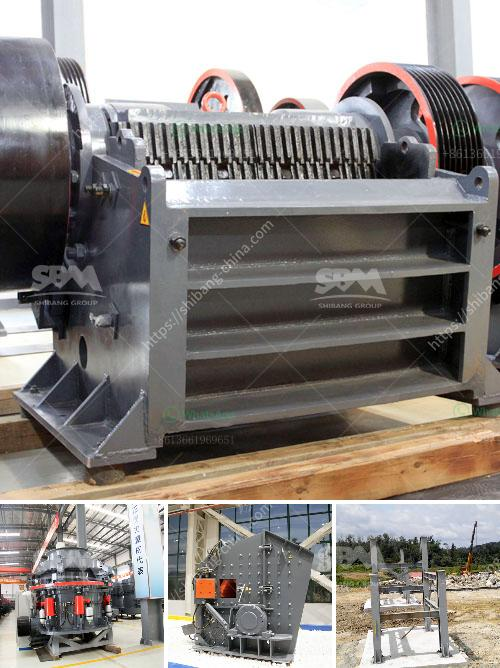

<h3>mobile cone crushing station for sale</h3>
With the increase in the demand for construction materials and the harsh requirements of quarries, operators are turning to mobile cone crushing stations as a cost-effective means of meeting these demands. These machines have proven to be reliable, versatile, and highly productive in various construction applications. This article explores the advantages of mobile cone crushing stations and why they are becoming increasingly popular in the market.

One of the notable advantages of mobile cone crushing stations is their flexibility and mobility. These stations are designed to be easily moved from one location to another, enabling operators to work efficiently in different quarries or construction sites. This eliminates the need for multiple fixed crushing plants, saving time and resources.

Mobile cone crushing stations offer a cost-effective solution for crushing materials at the construction site or quarry. The crushed material can be directly reused on-site or sold for profit. By eliminating the need for transportation to a fixed crusher, operators save on transportation costs, which can be significant. Additionally, the energy-efficient operation of these machines reduces fuel consumption and minimizes operating costs.

Mobile cone crushing stations are equipped with cone crushers that can be adapted to various types of materials and different applications. The cone crusher can be used in the secondary, tertiary, or quaternary position, depending on the application. The high reduction ratio enables a high-quality end product.

The mobile cone crushing station maximizes productivity by utilizing the advanced technology and features available in cone crushers. This includes a balanced eccentric design, which provides smooth operation, higher capacity, and uniform product size. The automated control system optimizes the performance by constantly adjusting the crusher settings, ensuring optimal productivity and efficiency.

Maintenance is crucial for the longevity and performance of any machine. Mobile cone crushing stations are designed to be easily maintained, minimizing downtime. Components such as the cone crusher, conveyor belts, and vibrating screens are easily accessible, simplifying maintenance tasks. Furthermore, advanced diagnostic tools and remote monitoring capabilities allow for proactive maintenance, reducing the risk of unexpected breakdowns.

Mobile cone crushing stations are designed with environmental considerations in mind. They are equipped with features such as dust suppression systems, noise reduction measures, and low emission engines, ensuring compliance with environmental regulations. These features not only benefit the environment but also improve the working conditions for operators.

Mobile cone crushing stations offer numerous advantages for operators in the construction and quarrying industries. Their flexibility, mobility, cost-effectiveness, and high productivity make them an attractive option for various applications. With advancements in technology and ongoing improvements, mobile cone crushing stations are likely to continue to revolutionize the crushing industry. Operators should consider investing in this efficient and adaptable solution to meet their crushing needs and stay ahead in a competitive market.
<h3>Contact us</h3><ul><li><strong>Whatsapp:&nbsp;<a href="https://wa.me/8613661969651">+8613661969651</a></strong></li><li><a href="https://swt.shibang-china.com/?git&amp;zhl&amp;mobile cone crushing station for sale"><strong>Online Service(chat now)</strong></a></li></ul><h3>Related</h3><ul><li><a href='basalt crusher supplier.md'>basalt crusher supplier</a></li><li><a href='cement grinding mill price invest cost.md'>cement grinding mill price invest cost</a></li><li><a href='calcium carbide plant and machinery.md'>calcium carbide plant and machinery</a></li><li><a href='gypsum crushing machine.md'>gypsum crushing machine</a></li><li><a href='cost of jaw crusher.md'>cost of jaw crusher</a></li></ul>