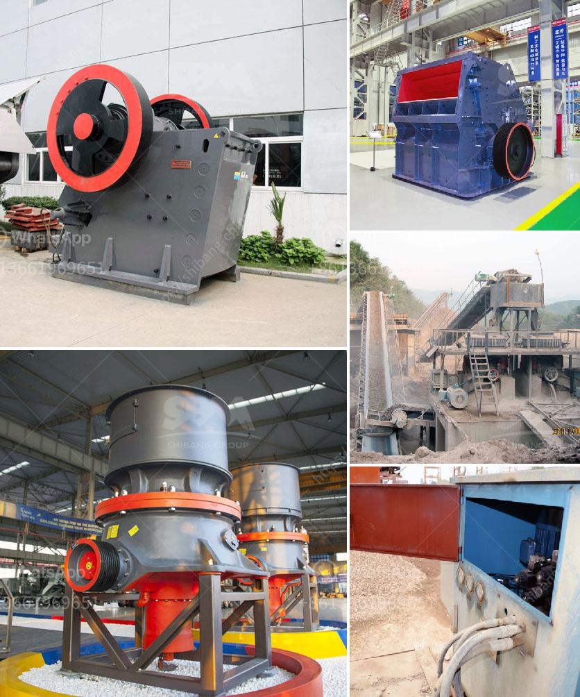

<h3>mobile crusher 150 tons capacity</h3>
Mobile Crusher 150 Tons Capacity - The stone crusher machines manufactured by various companies are commonly used to break down large stones into smaller, manageable sizes. Most of these machines have a hydraulic system, which allows the user to adjust the size of the output material. In recent years, mobile crushers have become increasingly popular due to their ease of transportation and higher capacity. One such machine is the mobile crusher with a capacity of 150 tons, which is perfect for large-scale construction projects.

In the past, construction companies had to rely on stationary crushers, which were often limited in their capacity. These crushers were restricted to a single location, making them less efficient and time-consuming to operate. However, with the advancements in technology, mobile crushers now offer a higher capacity and increased flexibility.

The mobile crusher with a capacity of 150 tons is especially suitable for large-scale construction projects. It not only eliminates the limitations of crushing sites and climate conditions but also has a higher output capacity than traditional fixed crushers. Equipped with advanced crushing technology, it can crush various types of materials, including granite, limestone, concrete, and demolition waste.

The mobile crusher consists of a vibrating feeder, a jaw crusher, a hydraulic crusher, and a vibrating screen. It has the advantages of strong mobility and convenient transportation. The materials are evenly fed into the crusher by the vibrating feeder, and the crusher efficiently breaks them down into smaller sizes. The crushed materials are then screened by the vibrating screen, allowing for the separation of different-sized particles.

The mobile crusher with a capacity of 150 tons offers several significant advantages over traditional crushers. Firstly, it is highly flexible, allowing it to be easily transported from one location to another. This means that construction companies can bring the crusher to the desired site, reducing the cost and time required for transportation. Additionally, the mobile crusher allows for on-site crushing, eliminating the need to transport the material to a fixed crusher location.

Furthermore, the mobile crusher has a higher capacity than traditional crushers. With a capacity of 150 tons, it can efficiently process large quantities of material, saving time and increasing productivity. This is particularly valuable for construction projects that require large amounts of crushed material, such as road construction or building foundations.

Overall, the mobile crusher with a capacity of 150 tons is an excellent option for construction companies looking to improve their efficiency and productivity. Its flexibility, mobility, and high capacity make it a valuable asset in large-scale construction projects. This machine helps to reduce transportation costs and time, allowing construction companies to work more efficiently on-site. With the advancement in crushing technology, mobile crushers are proving to be an essential tool in the construction industry.
<h3>Contact us</h3><ul><li><strong>Whatsapp:&nbsp;<a href="https://wa.me/8613661969651">+8613661969651</a></strong></li><li><a href="https://swt.shibang-china.com/?git&amp;zhl&amp;mobile crusher 150 tons capacity"><strong>Online Service(chat now)</strong></a></li></ul><h3>Related</h3><ul><li><a href='carbon black processing plant.md'>carbon black processing plant</a></li><li><a href='gold hammer mill used forr sale in zimbabwe.md'>gold hammer mill used forr sale in zimbabwe</a></li><li><a href='crusher equipment oman in muscat oman.md'>crusher equipment oman in muscat oman</a></li><li><a href='cone crushers manufacturers.md'>cone crushers manufacturers</a></li><li><a href='rod mill manufacturer in europe.md'>rod mill manufacturer in europe</a></li></ul>