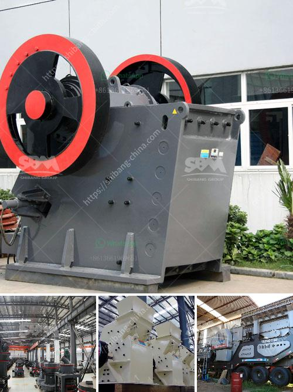

<h3>mobile crusher algerie</h3>
In recent years, the issue of construction waste has become a prominent concern in Algeria. With rapid urbanization and infrastructure development, the amount of waste generated from construction activities has increased significantly. The management and disposal of this waste pose serious environmental and health risks. To tackle this problem, the introduction of mobile crushers in Algeria has proven to be a game-changer.

Mobile crushers, also known as portable crushing plants, are machines designed to reduce large rocks into smaller ones or gravel particles. These machines are equipped with advanced crushing techniques, enabling them to process various types of construction waste into reusable materials such as recycled concrete aggregate, crushed stones, or sand.

One of the key advantages of mobile crushers is their flexibility and mobility. They can be easily transported to and from different construction sites, allowing for on-site crushing and recycling. This eliminates the need for multiple transportation trips to dumping sites, resulting in reduced transportation costs and carbon emissions.

Furthermore, mobile crushers have a high production capacity, enabling the efficient processing of a large quantity of waste materials within a short period of time. This not only accelerates construction projects but also contributes to the conservation of natural resources. By reusing recycled materials instead of extracting and processing new ones, mobile crushers help mitigate the depletion of raw materials, making it a sustainable solution for construction waste management.

In addition to environmental benefits, mobile crushers also offer economic advantages. The production of recycled materials using mobile crushers is often cost-effective compared to traditional methods. Moreover, the use of recycled materials reduces the need for purchasing new aggregates, resulting in considerable savings for construction companies.

The adoption of mobile crushers in Algeria marks a significant step towards sustainable construction practices and waste reduction. By effectively managing and reusing construction waste, the country can make significant progress in achieving its environmental and sustainability goals.

In conclusion, mobile crushers in Algeria are revolutionizing the construction industry by providing an efficient and eco-friendly solution to the problem of construction waste. These machines offer not only environmental benefits but also economic advantages, making them an essential tool for construction companies. As the country continues to grow and develop, the integration of mobile crushers is paramount in ensuring a sustainable and greener future for Algeria.
<h3>Contact us</h3><ul><li><strong>Whatsapp:&nbsp;<a href="https://wa.me/8613661969651">+8613661969651</a></strong></li><li><a href="https://swt.shibang-china.com/?git&amp;zhl&amp;mobile crusher algerie"><strong>Online Service(chat now)</strong></a></li></ul><h3>Related</h3><ul><li><a href='land available for stone quarry.md'>land available for stone quarry</a></li><li><a href='coal washing plant manufacturers india.md'>coal washing plant manufacturers india</a></li><li><a href='second hand stone crushing plants india.md'>second hand stone crushing plants india</a></li><li><a href='cement grinding mill pdf.md'>cement grinding mill pdf</a></li><li><a href='pe jaw crusher price list.md'>pe jaw crusher price list</a></li></ul>