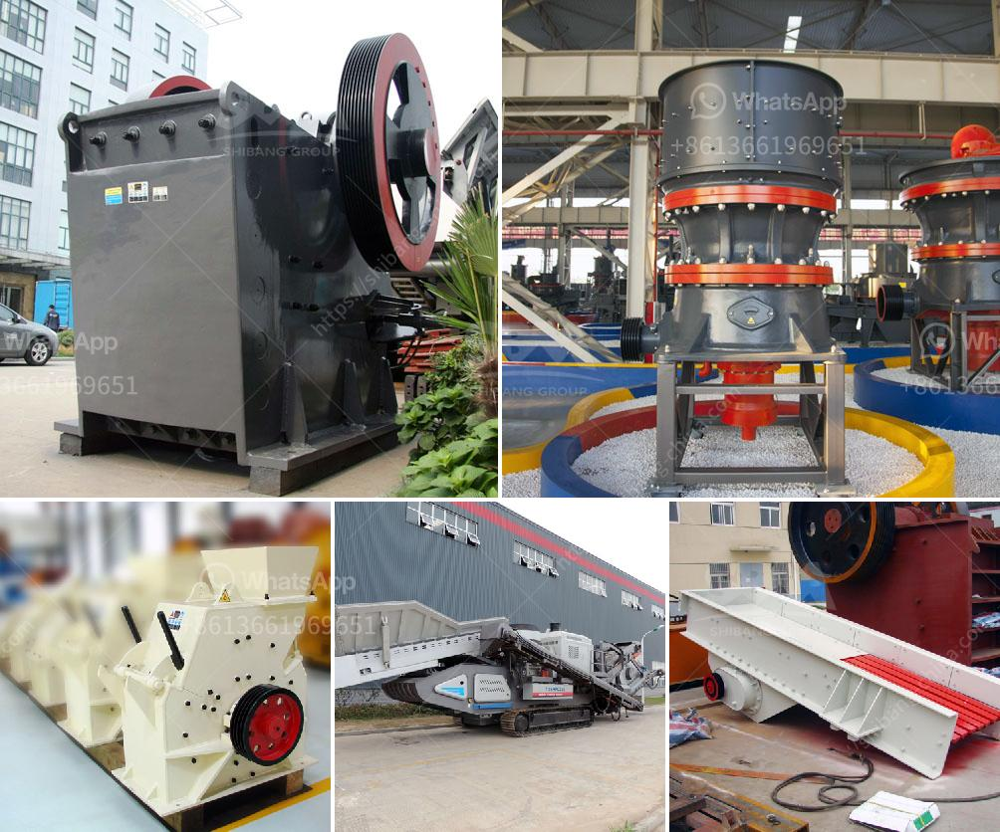

<h3>mobile crusher debris</h3>
In today's fast-paced world, waste management has become a major concern. As populations increase and urbanization expands, the amount of debris generated is also on the rise. The efficient disposal and recycling of construction and demolition waste are critical not only for the environment but also for the sustainable development of our cities. Here's where mobile crusher debris comes into play, providing a solution to convert waste into valuable resources.

Mobile crushers are innovative machines designed to crush and screen construction debris on-site. These devices are equipped with powerful crushers and high-quality screens that efficiently reduce debris to a desired size, allowing for effective recycling.

One of the significant advantages of mobile crushers is their ability to process a wide range of materials. From concrete and bricks to asphalt and rock, these machines can handle diverse debris types. By crushing debris on-site, transportation costs are greatly minimized, as the material can be directly used as fill or base material for new construction projects.

Furthermore, mobile crushers are highly versatile and can be easily transported between different worksites. This flexibility allows for on-demand crushing, providing contractors with the ability to quickly respond to project needs. As a result, time and resources are saved, promoting efficiency in the construction industry.

The environmental benefits of mobile crusher debris should not be overlooked. By recycling waste on-site, the demand for natural resources, such as gravel and sand, is reduced. This helps preserve natural ecosystems that would otherwise be disrupted by excessive extraction. Moreover, by minimizing the need for transportation, mobile crushers also contribute to reduced carbon emissions and overall environmental impact.

In addition to environmental advantages, mobile crushers also offer economic benefits. By utilizing debris as a valuable resource, construction companies can reduce their material costs significantly. Instead of purchasing new raw materials, they can utilize recycled debris, which is often available at a lower cost. This cost reduction ultimately leads to more competitive pricing in the market, benefiting both construction companies and their clients.

Furthermore, mobile crushers contribute to job creation and economic growth. The presence of such equipment requires skilled operators and technicians, creating employment opportunities in the construction sector. Additionally, the recycling industry that revolves around mobile crusher debris generates revenue and contributes to the overall economic development of a region.

In conclusion, mobile crusher debris plays a vital role in transforming waste into valuable resources. These innovative machines provide an efficient and sustainable solution to tackle the growing problem of construction and demolition waste. By crushing debris on-site, mobile crushers reduce transportation costs, preserve natural resources, and promote environmental sustainability. Moreover, they offer economic benefits, including reduced material costs, job creation, and overall economic growth. Embracing mobile crusher debris technology is a significant step towards achieving a greener and more sustainable construction industry.
<h3>Contact us</h3><ul><li><strong>Whatsapp:&nbsp;<a href="https://wa.me/8613661969651">+8613661969651</a></strong></li><li><a href="https://swt.shibang-china.com/?git&amp;zhl&amp;mobile crusher debris"><strong>Online Service(chat now)</strong></a></li></ul><h3>Related</h3><ul><li><a href='rental mesin stone crusher.md'>rental mesin stone crusher</a></li><li><a href='suppliers kenya crusher.md'>suppliers kenya crusher</a></li><li><a href='jaw crusher in uzbekistan.md'>jaw crusher in uzbekistan</a></li><li><a href='chrome crushing plant.md'>chrome crushing plant</a></li><li><a href='chrome ore refinery processing plant.md'>chrome ore refinery processing plant</a></li></ul>