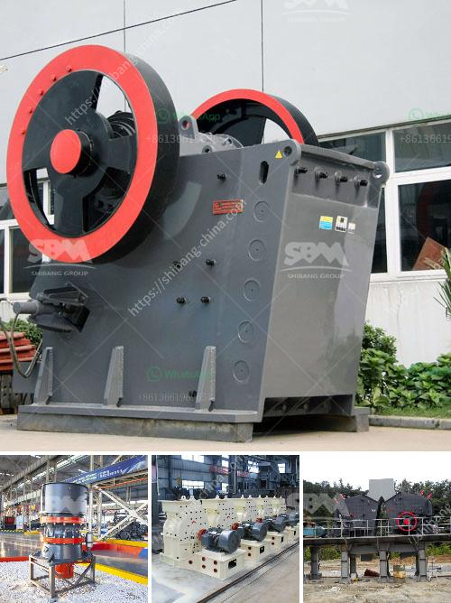

<h3>mobile crusher for hire in ghana</h3>
Mobile crusher, also known as mobile crushing plant, is a type of equipment that involves a robust construction and highly sophisticated technology. It has become a preferred option in the construction industry globally due to its ease of use and flexibility. Mobile crusher for hire in Ghana ensures the process runs smoothly, resulting in increased productivity and efficiency. The machine is safely operated by qualified personnel and can be transported to any location in Ghana during the rental period.

One of the primary advantages of mobile crushers is its versatility. They can crush a wide range of materials, including concrete, rock, asphalt, and aggregate. This flexibility ensures that customers can be confident in finding the suitable material and crushing solution for their specific project requirements. Whether it is crushing large rocks or small gravel, mobile crushers provide reliable and efficient results.

The mobile crushing plant is equipped with an integrated screening system to help separate the desired materials from unwanted ones. This ensures that the final product is of a consistent quality and meets the unique specifications of the project. Whether it is for road construction, building construction, or any other application, the versatility of the mobile crusher allows for efficient processing of materials on-site.

Furthermore, hiring a mobile crusher in Ghana eliminates the need for expensive transportation of raw materials. Instead of transporting materials to a fixed crushing site, they can be crushed directly at the project location. This significantly reduces transportation costs and the time required to complete the project. Additionally, it allows for greater control and supervision of the crushing process, ensuring that it meets the highest standards of quality.

Mobile crusher for hire in Ghana is also environmentally friendly as it operates on an electric power source. This eliminates the need for fossil fuel consumption and reduces carbon emissions, making it a sustainable choice. With the increasing focus on environmentally friendly and sustainable practices, renting a mobile crusher in Ghana aligns with the global efforts towards responsible and eco-friendly construction.

In conclusion, mobile crusher for hire in Ghana offers numerous benefits for construction projects. Its versatility, efficiency, and environmental friendliness make it an ideal choice for various applications. The ability to crush materials on-site significantly reduces transportation costs and time, improving overall project efficiency. Whether it is for road construction, building construction, or any other application, mobile crushers provide reliable and efficient results. So, if you have a construction project in Ghana, consider hiring a mobile crusher to optimize productivity and ensure high-quality results.
<h3>Contact us</h3><ul><li><strong>Whatsapp:&nbsp;<a href="https://wa.me/8613661969651">+8613661969651</a></strong></li><li><a href="https://swt.shibang-china.com/?git&amp;zhl&amp;mobile crusher for hire in ghana"><strong>Online Service(chat now)</strong></a></li></ul><h3>Related</h3><ul><li><a href='gold production process flow chart.md'>gold production process flow chart</a></li><li><a href='waived diamond mesh equipment south africa.md'>waived diamond mesh equipment south africa</a></li><li><a href='portable concrete crusher for rent qatar.md'>portable concrete crusher for rent qatar</a></li><li><a href='ball mill suppliers india stone crusher machine.md'>ball mill suppliers india stone crusher machine</a></li><li><a href='sale stone quarry crusher plant india.md'>sale stone quarry crusher plant india</a></li></ul>