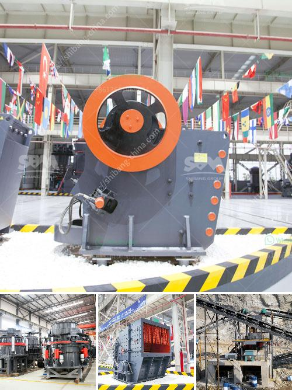

<h3>mobile crusher hire in uae</h3>
The liberation movement of materials is at the forefront of modern construction. Mobile crushers offer an excellent way to remove the obstacles and pave the way for new opportunities at construction sites. Mobile crushers can significantly reduce inefficiencies, decrease operational costs, and find new and better ways to power and control your equipment. In the UAE, various industries such as mining, construction, and others rely heavily on mobile crushers for operations. However, not every company has the necessary resources to own and maintain a fleet of these machines. This is where mobile crusher hire services come into play.

Mobile crusher hire services are offered by numerous crushing and screening companies all over the world. When you need to hire a crusher, whether it's in the UAE or elsewhere, it's important to understand the rental terms and conditions, the process, and the cost involved. Mobile crusher hire services often come with a range of optional equipment to complement the functionality of the crushers such as screeners and conveyors. Mobile crushers offer flexibility and convenience, so it's important to consider what you need before making a decision.

One of the key advantages of hiring a mobile crusher in the UAE is the versatility it offers. By choosing the right configuration and adding optional equipment, you can create a machine that perfectly fits your specific needs. Whether you need to crush rocks, recycle materials, or demolish structures, mobile crushers can be adapted to tackle a wide range of applications. This flexibility allows you to address different projects and cater to various demands while maximizing productivity on your construction sites.

Another advantage of mobile crusher hire in the UAE is cost-effectiveness. Renting a mobile crusher eliminates the need for capital investment, maintenance costs, and storage space. You simply pay a fixed rental rate for the period you require the crusher. This gives you better control over your budget and allows you to allocate resources more efficiently. In addition, mobile crushers are typically more fuel-efficient than traditional crushers, which can also help reduce costs in the long run.

When it comes to finding the right mobile crusher hire service provider in the UAE, conducting thorough research is essential. Look for a company that has a track record of delivering high-quality and reliable machinery. Check if the company offers the specific type of crusher you need and inquire about the range of optional equipment available. It's also important to understand the maintenance and support services offered by the company to ensure smooth operation and minimize downtime.

In conclusion, mobile crusher hire services play a crucial role in the construction industry, and the UAE is no exception. By opting for mobile crusher hire instead of purchasing your own machine, you can enjoy the benefits of versatility, cost-effectiveness, and reduced maintenance. Whether you need to crush rocks, recycle materials, or demolish structures, mobile crushers provide a convenient and efficient solution for your construction projects. Therefore, taking the time to research and find a reliable mobile crusher hire service provider is essential to ensure optimum results on your construction sites.
<h3>Contact us</h3><ul><li><strong>Whatsapp:&nbsp;<a href="https://wa.me/8613661969651">+8613661969651</a></strong></li><li><a href="https://swt.shibang-china.com/?git&amp;zhl&amp;mobile crusher hire in uae"><strong>Online Service(chat now)</strong></a></li></ul><h3>Related</h3><ul><li><a href='crusher machine price.md'>crusher machine price</a></li><li><a href='jaw crusher in uzbekistan.md'>jaw crusher in uzbekistan</a></li><li><a href='gold ore processing equipment manufacturer.md'>gold ore processing equipment manufacturer</a></li><li><a href='how much is scm series ultrafine mill machine in usa.md'>how much is scm series ultrafine mill machine in usa</a></li><li><a href='rock crushers cost tons per hour.md'>rock crushers cost tons per hour</a></li></ul>