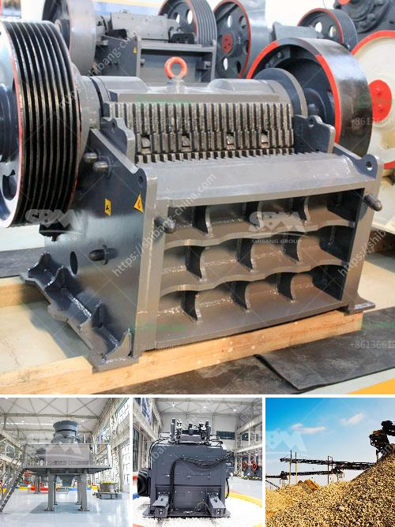

<h3>mobile crusher in dubai</h3>
Mobile crushers play an indispensable role in the recycling of construction waste. They are also used for various types of aggregate production. Different types of crushers are available in the market, which can help in processing materials in different ways.

Dubai is one of the fastest-growing construction markets in the world. This growth has led to a significant increase in construction waste generation in the region. To efficiently manage this waste and meet the demand for recycled aggregates, mobile crushers are being used in Dubai.

Mobile crushers are versatile machines that are used to reduce the size of rocks and other materials in the construction industry. They can be mounted on wheeled trailers or on track, depending on the application. Mobile crushers are loaded on low-loaders or towed by truck horse when transported over longer distances to their final destination.

One of the key advantages of using mobile crushers is that they can move easily around the job site and require minimum infrastructure for operation. They can crush materials directly at the construction site, eliminating the need for transporting them to a central processing facility. This not only saves time but also reduces transportation costs, making them an economical choice for contractors in Dubai.

Mobile crushers in Dubai are designed to crush and process different types of material such as limestone, granite, basalt, gravel, sandstone, and other similar materials. They also help in recycling construction waste such as concrete, bricks, and asphalt. This greatly reduces the cost of transporting materials to the landfill or recycling facility.

In addition to their high mobility and cost-effectiveness, mobile crushers also offer various other advantages. They are equipped with advanced technology and features that increase productivity and efficiency. For example, many mobile crushers have a vibrating feeder that allows the material to be evenly fed into the crusher. They also have a conveyor belt that transports the crushed material to a desired location.

Moreover, mobile crushers can be equipped with different types of screens to produce different sizes of aggregates. This allows contractors in Dubai to produce aggregates of various sizes as per their project requirements. The versatility and flexibility of mobile crushers make them a go-to choice for contractors operating in Dubai.

In conclusion, mobile crushers are playing a crucial role in Dubai's construction industry by efficiently processing construction waste into recycled aggregates. They offer high mobility, cost-effectiveness, and various other advantages that make them an ideal choice for contractors. With the growing demand for recycled aggregates, mobile crushers are expected to continue to play a crucial role in Dubai's construction sector.
<h3>Contact us</h3><ul><li><strong>Whatsapp:&nbsp;<a href="https://wa.me/8613661969651">+8613661969651</a></strong></li><li><a href="https://swt.shibang-china.com/?git&amp;zhl&amp;mobile crusher in dubai"><strong>Online Service(chat now)</strong></a></li></ul><h3>Related</h3><ul><li><a href='fine powder mill.md'>fine powder mill</a></li><li><a href='complete stone crushering plant shanghai.md'>complete stone crushering plant shanghai</a></li><li><a href='machinery needed for limestone extraction.md'>machinery needed for limestone extraction</a></li><li><a href='listing price tons per hour screw conveyor.md'>listing price tons per hour screw conveyor</a></li><li><a href='small rock crusher for sale.md'>small rock crusher for sale</a></li></ul>