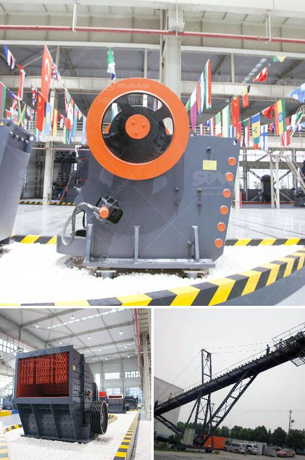

<h3>mobile crusher in japan used crusher</h3>
Mobile crusher in Japan is extensively used in the fields of construction waste crushing, retaining wall construction, concrete mixing and recycling, road and railway construction, metallurgy and chemical industry, etc. Japanese technology and design have contributed to the durability and efficient performance of these crushers. Mobile crushers are available in different models, including crawler and tire-mounted types, to ensure flexibility and easy transportation.

One of the significant advantages of mobile crushers is their ability to move freely on various terrains. This makes them ideal for working in rough environments and remote areas. They can be easily transported from one site to another, saving time and reducing transportation costs. Additionally, the compact size of these crushers allows for easy maneuvering in tight spaces, such as construction sites with limited accessibility.

Another key feature of mobile crushers is their high crushing capacity. They are designed to crush a wide range of materials, including concrete, rocks, and asphalt. This ensures efficient recycling of construction waste and helps reduce the environmental impact of material disposal.

The crushers in Japan are known for their reliability and durability. They are manufactured with robust materials and undergo rigorous quality control measures, ensuring their long service life. Moreover, Japanese crushers are equipped with advanced technologies, such as hydraulic systems and automated controls, which enhance their operational efficiency and make them user-friendly.

In conclusion, mobile crushers in Japan are highly efficient and versatile machines that contribute to various industrial sectors. Their mobility, high crushing capacity, and advanced features make them suitable for a wide range of applications. With the increasing focus on sustainable development and waste management, these crushers play a crucial role in recycling construction waste and reducing environmental impact. Therefore, mobile crushers are the preferred choice for many contractors and industries in Japan.
<h3>Contact us</h3><ul><li><strong>Whatsapp:&nbsp;<a href="https://wa.me/8613661969651">+8613661969651</a></strong></li><li><a href="https://swt.shibang-china.com/?git&amp;zhl&amp;mobile crusher in japan used crusher"><strong>Online Service(chat now)</strong></a></li></ul><h3>Related</h3><ul><li><a href='jaw crusher plant for sale.md'>jaw crusher plant for sale</a></li><li><a href='gold wash plant irs california.md'>gold wash plant irs california</a></li><li><a href='gold mining equipment plant for sales.md'>gold mining equipment plant for sales</a></li><li><a href='used rock roll crusher.md'>used rock roll crusher</a></li><li><a href='sand making machine equipment.md'>sand making machine equipment</a></li></ul>