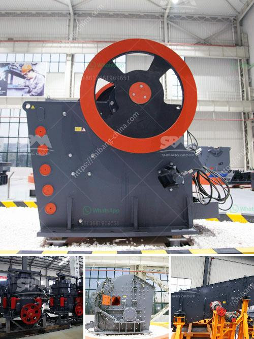

<h3>mobile crusher in the coal mining</h3>
Coal mining is a complex and demanding task that requires a highly specialized machine capable of handling large amounts of material every day. To meet these requirements, a mobile crusher is often the most effective way to mine coal in open-pit mining operations.

In the past, coal mining was conducted manually and required the use of explosives to loosen the coal seams. As technology advanced, miners developed machinery such as the mobile crusher, allowing them to dig deeper and extract more coal. Mobile crushers enable operations to take place close to the extraction points in mines and quarries.

Choice of crusher model will depend on: - material to be crushed and its resistance to compression - the maximum size of the initial pieces - desired output size - treatment capacity in tons per hour

Please correct the marked field(s) below. Join us and receive offers, news, and talking points from our team. Email * Phone Number * Job Title * Company * Select list(s) to subscribe to From TFA Website Example: Yes, I would like to receive emails from Technical Fabrication & Construction, Inc.. (You can unsubscribe anytime) Constant Contact Use. By submitting this form, you are consenting to receive marketing emails from: Technical Fabrication & Construction, Inc., 2140 Monticello Road, Montgomery, AL, 36107, https://www.technicalfab.com/. You can revoke your consent to receive emails at any time by using the SafeUnsubscribe® link, found at the bottom of every email. Emails are serviced by Constant Contact

When choosing the crusher for coal mining, it is advisable to consider certain factors such as the capacity, size, and power of the machine. Additionally, the energy consumption should be taken into account. A mobile crusher can tolerate small amounts of impurities such as sand, clay, and iron.

However, the extreme conditions in a coal mine require the robust construction of the mobile crusher, ensuring it is up to the challenge. This means that a mobile crusher must have an efficient system designed to prevent dust and noise emissions.

To ensure safety and prevent accidents, most mobile crushers are equipped with hydraulic systems. The hydraulic system allows for quick and easy accessibility to all key components of the crusher, reducing maintenance downtime.

In conclusion, a mobile crusher in coal mining can provide a high level of flexibility and reliability, and greatly enhance the efficiency of coal mining operations. With the evolution of technology and increase in demand for coal per unit efficiency, mobile mining crushers are the ideal choice for coal mining operations.
<h3>Contact us</h3><ul><li><strong>Whatsapp:&nbsp;<a href="https://wa.me/8613661969651">+8613661969651</a></strong></li><li><a href="https://swt.shibang-china.com/?git&amp;zhl&amp;mobile crusher in the coal mining"><strong>Online Service(chat now)</strong></a></li></ul><h3>Related</h3><ul><li><a href='vertical roller mill for cement grinding.md'>vertical roller mill for cement grinding</a></li><li><a href='mobile crushers south africa.md'>mobile crushers south africa</a></li><li><a href='stone crushing and screening plant.md'>stone crushing and screening plant</a></li><li><a href='ballast making machine kenya.md'>ballast making machine kenya</a></li><li><a href='cost of establishing a quarry in nigeria.md'>cost of establishing a quarry in nigeria</a></li></ul>