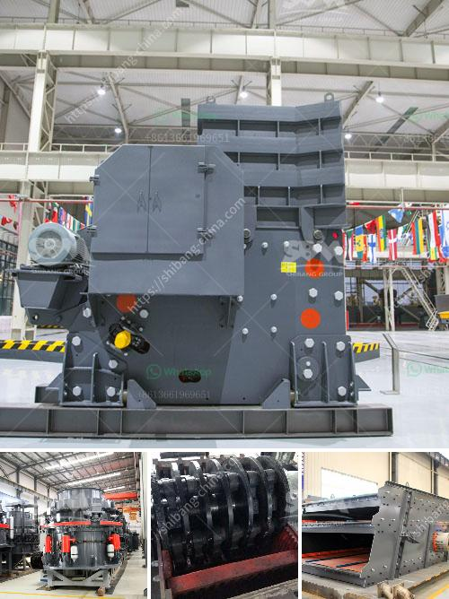

<h3>mobile crusher in uae for sale</h3>
Mobile crushing plant is a widely used crusher machine in the industry of mining, metallurgy, building materials, traffic, water conservancy, and so on. If you are interested in mobile crushing plant, you can read the following article and choose suitable mobile crusher for your UAE aggregate crushing plant.

The cost of the mobile crusher plant is inversely proportional to its output. If you choose a machine with a large output and a good quality, the cost may be higher. But if you choose a machine with a small output and an average quality, the cost may be lower. So it is important to choose a suitable mobile crusher according to your specific needs.

The mobile crusher in UAE for sale is mainly used to crush stones and rock materials into small size or particle. The crushed material can be used as the raw materials for various construction and other industries. With the deepening of excavation, the transportation costs of the materials also become lower and the mobile crusher becomes the preferred crushing equipment in the mine. Mobile crusher has reasonable matching of various crushing equipment, and the whole production flow is reliable and convenient to operate. The machine is able to shred large materials into small granules, improving the efficiency of the subsequent process.

The mobile crusher is convenient to operate and has high flexibility. All the components of the mobile crusher are installed on the truck, which can greatly reduce the transportation cost. In addition, it can be directly driven to the working site, saving transportation time and costs. The mobile crusher has excellent value-holding capacity, easy to get investors' support, making it enhance the value of mines.

Meanwhile, human resource costs in the UAE are also very high and often far outweigh material costs. Therefore, reducing labor costs can increase economic benefits. The mobile crusher is not only used in the treatment of construction waste, but also used in the field of rock, concrete, quarry, coal mining, materials recycling, and others. Over years, UAE has supplied the most advanced and powerful crushers and equipment to thousands of customers from various industries. These machines are efficiently designed, require minimum maintenance, and are available at cost-effective prices.

As mentioned above, mobile crushers in UAE for sale include the crusher machine for hard material, cone crusher, roller crusher, etc. They are designed to handle large rocks, sand, gravel, and ore material. The crushing capability of a mobile crusher can be customized and tailor-made to meet the most demanding specifications. Ideal for any type of stone, the mobile crusher plant is a reliable moveable crushing device. It can not only be operated independently, but also be equipped with other mobile crushers, such as mobile jaw crusher, mobile impact crusher, mobile cone crusher, etc.

With the increasing demand for various types of mobile crushers in UAE, the market outlook is promising, and the sales of mobile crushers are booming. The mobile crusher in UAE for sale will be the most suitable equipment for breaking stones into small size. The benefit is that it can be moved to the desired location and operated as a single production line or multiple production lines. Over years, the UAE has supplied the most advanced mobile crushing plants to the mining industry and construction waste processing sites. Mobile crushing plants improve human resource utilization rate and reduce operating costs, ensuring the sustainable development of the UAE economy.
<h3>Contact us</h3><ul><li><strong>Whatsapp:&nbsp;<a href="https://wa.me/8613661969651">+8613661969651</a></strong></li><li><a href="https://swt.shibang-china.com/?git&amp;zhl&amp;mobile crusher in uae for sale"><strong>Online Service(chat now)</strong></a></li></ul><h3>Related</h3><ul><li><a href='stone sand making process pdf.md'>stone sand making process pdf</a></li><li><a href='stone crusher plant supplier.md'>stone crusher plant supplier</a></li><li><a href='prices for stone crushing machine zimbabwe.md'>prices for stone crushing machine zimbabwe</a></li><li><a href='limestone grinding machine.md'>limestone grinding machine</a></li><li><a href='buy stone crushing machine in kenya.md'>buy stone crushing machine in kenya</a></li></ul>