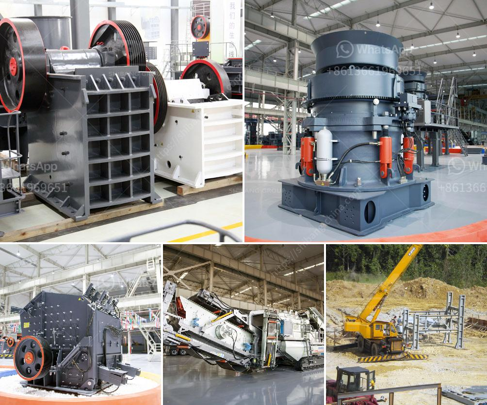

<h3>mobile crusher track</h3>
Mobile crushers are essential for the crushing of materials as they can reduce large rock formations into smaller gravel or even dust particles. The track-mounted mobile crushers offer excellent mobility and maneuverability, making them suitable for a wide range of applications.

One of the advantages of a mobile crusher track is its ability to move around the job site easily. This means that operators can transport the crusher to different locations within the construction site or even to different sites altogether. The mobility of the mobile crusher track is especially beneficial when working on projects with tight deadlines or in areas with limited access.

Additionally, the track-mounted mobile crusher offers flexibility in terms of the types of materials that can be crushed. Whether it is rocks, ore, concrete, or asphalt, these crushers can handle various materials efficiently. This versatility makes them useful in various industries, including mining, construction, and recycling.

Another benefit of the mobile crusher track is its efficiency in crushing materials. With hydraulic-driven track systems, these crushers deliver high production rates and can easily handle large quantities of material. This results in reduced processing time and increased productivity for the operators.

Furthermore, the compact size of the mobile crusher track allows for easy transportation and storage. This is particularly important for companies operating in urban areas or those with limited space. The track-mounted crushers can be easily transported on standard trailers and stored when not in use.

In conclusion, the mobile crusher track is a valuable resource for construction and mining industries. It offers exceptional mobility, versatility, and efficiency. Whether it is for breaking rocks or recycling materials, these crushers contribute to increased productivity and smoother operations on the job site.
<h3>Contact us</h3><ul><li><strong>Whatsapp:&nbsp;<a href="https://wa.me/8613661969651">+8613661969651</a></strong></li><li><a href="https://swt.shibang-china.com/?git&amp;zhl&amp;mobile crusher track"><strong>Online Service(chat now)</strong></a></li></ul><h3>Related</h3><ul><li><a href='pioneer ve rock crusher.md'>pioneer ve rock crusher</a></li><li><a href='concrete jaw crusher.md'>concrete jaw crusher</a></li><li><a href='used machines philippines ball mill.md'>used machines philippines ball mill</a></li><li><a href='large capacity jaw crusher machines sales to india.md'>large capacity jaw crusher machines sales to india</a></li><li><a href='to buy a coal wash plant in germany.md'>to buy a coal wash plant in germany</a></li></ul>