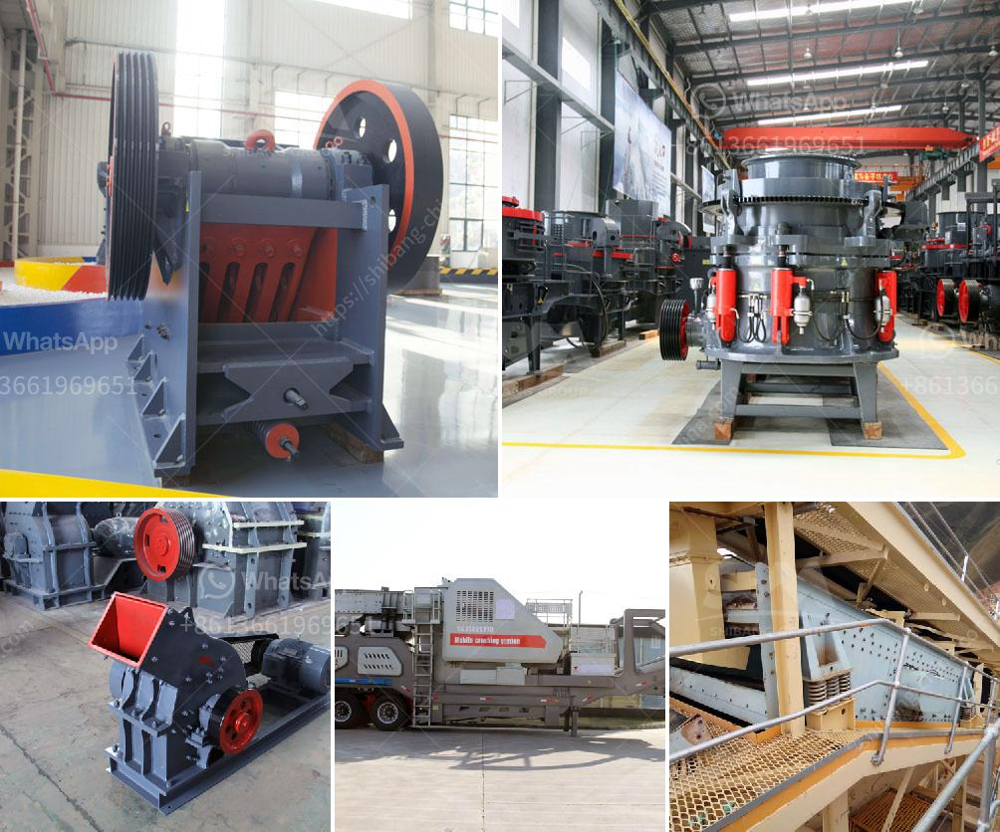

<h3>mobile crushers for sale uk</h3>
Mobile crushers are becoming increasingly popular in the UK due to their versatility and efficiency in the crushing and recycling of construction waste. These machines can be easily transported to construction sites along with the materials, reducing the need for costly transportation and disposal of waste materials.

One of the primary benefits of using mobile crushers is their ability to process a wide range of materials, including concrete, asphalt, brick, and rocks. This makes them suitable for various applications, such as road construction, building demolition, and on-site recycling projects. The crushing process can be adjusted to produce a desired size of the end product, ensuring maximum efficiency and cost-effectiveness.

In addition to their versatility, mobile crushers are compact and easy to maneuver, making them suitable for both urban and remote locations. Their mobility allows contractors and construction companies to quickly set up and dismantle the machine, reducing the overall project time and costs.

The UK market offers a wide range of mobile crushers for sale, including jaw crushers, cone crushers, and impact crushers. These machines can process a variety of materials, such as limestone, granite, and concrete, with a wide range of output capacities. It is important to consider the customer's needs and budget when choosing the right mobile crusher for sale in the UK.

Mobile crushers are often equipped with additional features that increase their efficiency and productivity. For example, some machines come with pre-screening capabilities, allowing the removal of fine materials before they enter the crusher. This helps to reduce wear and tear on the machine and ensures a higher quality of the final product. Other features may include dust suppression systems, magnetic separators, and remote control operation, providing a safer and more user-friendly experience.

When considering purchasing a mobile crusher in the UK, it is crucial to choose a reputable supplier that offers reliable products and excellent after-sales service. This ensures that the machine will be well-maintained and any potential issues will be promptly addressed. It is also important to check the specifications and performance of the crusher, ensuring that it meets the specific requirements of the project.

In conclusion, mobile crushers are a cost-effective and environmentally-friendly solution for the crushing and recycling of construction waste. Their versatility and compactness make them suitable for various applications and locations. The UK market offers a wide range of mobile crushers for sale, providing customers with a variety of options to fit their needs and budget. It is essential to choose a reputable supplier that offers reliable products and excellent after-sales service to ensure a successful and efficient crushing operation.
<h3>Contact us</h3><ul><li><strong>Whatsapp:&nbsp;<a href="https://wa.me/8613661969651">+8613661969651</a></strong></li><li><a href="https://swt.shibang-china.com/?git&amp;zhl&amp;mobile crushers for sale uk"><strong>Online Service(chat now)</strong></a></li></ul><h3>Related</h3><ul><li><a href='grinding and milling machines.md'>grinding and milling machines</a></li><li><a href='jaw crusher production line diagram.md'>jaw crusher production line diagram</a></li><li><a href='rock screening plants.md'>rock screening plants</a></li><li><a href='iron ore concentrate plant tpa production.md'>iron ore concentrate plant tpa production</a></li><li><a href='waived diamond mesh equipment south africa.md'>waived diamond mesh equipment south africa</a></li></ul>