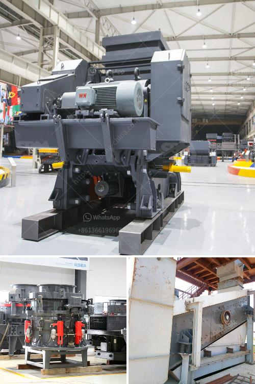

<h3>mobile crushers south africa</h3>
Mobile crusher or commonly known as mobile crushing plant is a crushing machine, especially suitable for crushing and recycling directly on-site. The mobile crusher takes advantage of the advantages of the traditional crusher and breaks the limitation of the cumbersome operation. The integration of the portable crushing plant eliminates the tedious operation and multi-stage crushing process. By optimizing the structure and function of the equipment, it not only realizes the flexible movement, but also greatly reduces the transportation cost and improves the work efficiency of the project.

South Africa, as one of the largest economies in its region, has a large amount of construction waste every day. With the continuous development of urbanization, the amount of construction waste generated in South Africa has also increased. Ordinary construction waste includes soil, concrete, broken bricks and other waste, which needs to be treated and recycled. The traditional method of disposing of construction waste is to landfill, which not only occupies a large amount of land resources, but also causes environmental pollution. Now, with the rise of mobile crusher, construction waste disposal has become easier and more efficient.

Mobile crusher in South Africa is the best choice for construction waste recycling. Mobile crusher stands out in the construction waste recycling industry in South Africa. The construction waste crushing process can be divided into two stages, namely, primary crushing stage and secondary crushing stage. Jaw crusher and impact crusher play an important role in the crushing process. The equipment is widely used in the construction industry due to its high production efficiency, low maintenance cost and simple operation.

Mobile crusher also improves the utilization rate of construction waste. According to statistics, every 1 ton of construction waste can be processed into 0.6 tons of recycled aggregates, and the utilization rate of construction waste is about 85%. The recycled aggregates can be used as raw materials for concrete, roadbeds, bricks and other building materials. In this way, the construction waste, instead of being discarded, can be turned into treasure, promoting sustainable development and environmental protection in South Africa.

In addition to the recycling of construction waste, mobile crushers in South Africa can also process various ores, such as iron ore, gold ore, coal, limestone, granite, basalt, quartz, etc. In the field of mine crushing, both stationary crusher and mobile crusher are the most ideal equipment for large stones and sand production lines.

In conclusion, mobile crushers in South Africa have made a great contribution to the construction waste disposal industry and have created huge economic benefits for construction waste recycling projects in South Africa. Whether selecting a mobile crusher from the standpoint of the company, choosing a good mobile crusher manufacturer or determining the specifications and models, it is important to choose according to actual needs and budget. The mobile crusher not only brings convenience to the users, but also creates greater value for the construction waste disposal industry in South Africa.
<h3>Contact us</h3><ul><li><strong>Whatsapp:&nbsp;<a href="https://wa.me/8613661969651">+8613661969651</a></strong></li><li><a href="https://swt.shibang-china.com/?git&amp;zhl&amp;mobile crushers south africa"><strong>Online Service(chat now)</strong></a></li></ul><h3>Related</h3><ul><li><a href='granite processing plant prices.md'>granite processing plant prices</a></li><li><a href='ball mill manufacture in chennai.md'>ball mill manufacture in chennai</a></li><li><a href='vertical mill for slag grinding.md'>vertical mill for slag grinding</a></li><li><a href='screen astec vibrating screen price.md'>screen astec vibrating screen price</a></li><li><a href='simple stone crushers kenya.md'>simple stone crushers kenya</a></li></ul>